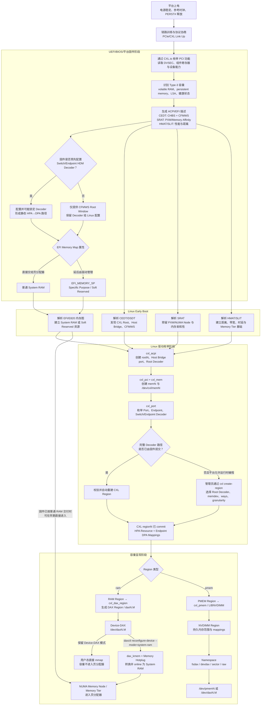
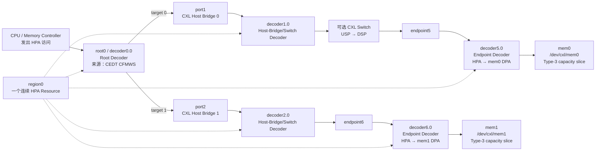
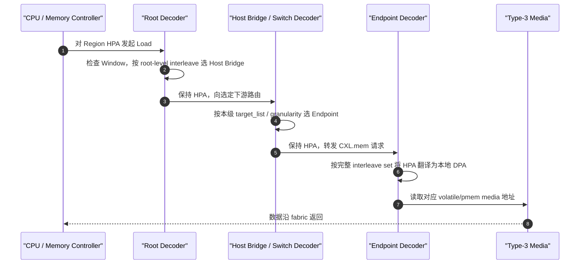
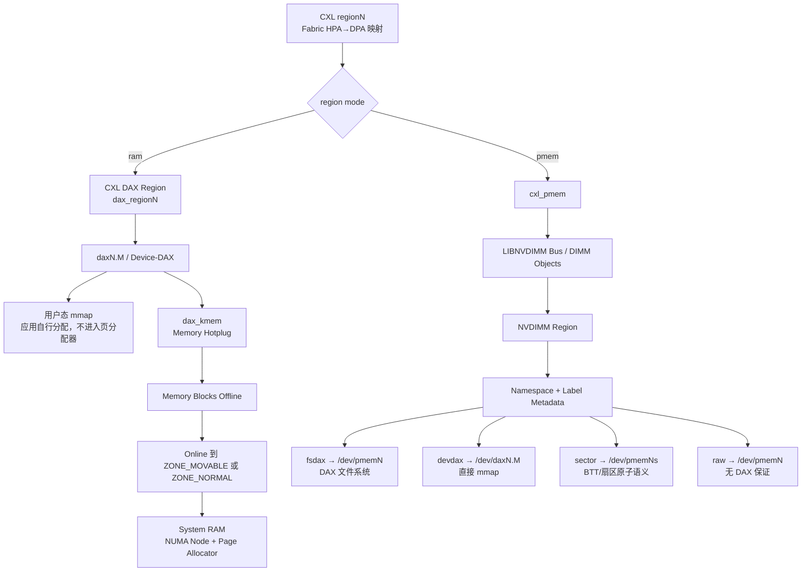

# CXL Type-3 设备：Linux 从上电到识别并使用内存的完整流程

> 适用范围：以 ACPI/UEFI 平台和当前主线 Linux CXL 内核文档为基线，覆盖 CXL Type-3 volatile RAM、persistent memory、单设备与多设备交织、固件预配置和 Linux 动态配置。不同 CPU 厂商、BIOS、内核版本及发行版回移补丁会造成日志、模块名和 sysfs 细节差异，实际操作应以目标系统能力为准。

## 0. 最核心的结论

“Linux 识别了 CXL 内存”不是一个单一状态，而是下面五层状态逐级成立：

| 层级 | 含义 | 典型证据 |
|---|---|---|
| L1：链路与 PCI 功能可见 | 主机已发现 Type-3 PCI/CXL 功能 | `lspci` 中存在对应 BDF，链路处于工作状态 |
| L2：CXL memdev 可管理 | `cxl_pci`/`cxl_mem` 已创建内存设备管理对象 | `/sys/bus/cxl/devices/memN`、`/dev/cxl/memN` |
| L3：拓扑与 Decoder 可用 | Root、Host Bridge、Switch、Endpoint 及 HDM Decoder 已枚举 | `rootN`、`portN`、`endpointN`、`decoderN.M` |
| L4：CXL Region 已提交 | 一段 Host Physical Address 已通过完整 Decoder 路径映射到一个或多个设备 DPA | `/sys/bus/cxl/devices/regionN`，`decode_state=commit` |
| L5：已交给内存消费者 | 容量已成为 System RAM、Device-DAX，或 PMEM Namespace | `numactl -H`/`lsmem`、`/dev/daxN.M`、`/dev/pmemN` |

因此：

- 看见 `mem0`，不代表容量已经成为可分配内存。
- 看见 `region0`，不代表内存已经 online。
- 看见 `/dev/dax0.0`，说明容量仍可能处于 Device-DAX 模式，而不是 System RAM。
- `Namespace` 主要属于持久内存路径；volatile CXL RAM 转成 System RAM 不需要 Namespace。
- CXL `regionN` 与 LIBNVDIMM `regionN` 是两个不同子系统的对象，即使名字恰好相同，也不能据编号推断它们一一对应。

---

## 1. 全流程总图



这张图包含三种常见策略：

1. **固件直接作为 System RAM 交付**：内存可能在 CXL 驱动完整 probe 之前就由 Linux 早期内存代码纳入页分配器。
2. **固件配置 Decoder，但标记为 Specific Purpose**：Linux 后期校验并自动重建 Region，再选择 Device-DAX 或 System RAM。
3. **软件定义内存**：固件只给出 CFMWS Root Window，Linux 用户态通过 `cxl create-region` 配置 Switch/Endpoint Decoder。

---

## 2. CXL Type-3 设备是什么

CXL Type-3 是“内存设备”类型。它通常包含：

- 一个可通过 PCI 枚举的 CXL.io 功能；
- 一个或多个通过 CXL.mem 提供的内存容量分区；
- volatile capacity、persistent capacity，或两者同时存在；
- HDM Decoder、设备组件寄存器、Mailbox、RAS/Poison/Health 能力；
- 若支持持久内存 Namespace Label，则还会有 Label Storage Area（LSA）。

协议用途应明确区分：

| 协议/接口 | 主要用途 |
|---|---|
| CXL.io | PCI 配置空间、设备枚举、MMIO、管理与 Mailbox 访问基础 |
| CXL.mem | CPU 对设备内存的加载/存储数据通路 |
| CXL.cache | 由需要缓存主机内存的设备使用；Type-3 内存设备的基本数据路径不依赖它 |

主机必须先通过 CXL.io 识别并配置设备；只有地址窗口和 Decoder 完整提交后，对该窗口的 CPU 访问才会沿 CXL.mem 到达设备容量。

---

## 3. 从硬件上电到 UEFI/BIOS 完成配置

### 3.1 电气与链路阶段

典型顺序如下，具体由平台电源和复位设计决定：

```text
设备电源轨稳定
→ 参考时钟有效
→ Sideband/管理控制器就绪
→ 释放 PERST#
→ PCIe LTSSM 链路训练
→ 协商可用速率、宽度及 CXL 模式
→ CXL.io 配置访问可用
```

注意事项：

- `lspci` 完全看不到设备时，应先查电源、复位、参考时钟、Retimer、Lane Mapping 和 Link Training，而不是先查 Region。
- 链路降速或降宽不会必然阻止枚举，但会降低实际带宽，并影响 Linux 根据链路能力计算的访问性能坐标。
- 经 CXL Switch 的设备必须保证 Upstream Port、Downstream Port 和 Endpoint 全路径链路均工作。

### 3.2 固件枚举 Type-3 能力

固件通过 PCI/CXL.io 发现设备后，通常会读取：

- PCI BDF、DVSEC 和组件寄存器位置；
- CXL.mem 支持情况；
- volatile 与 persistent capacity；
- HDM Decoder 数量、ways、granularity 和目标能力；
- 设备安全、固件版本、健康、错误及 Poison 状态；
- CDAT 或可供后续系统读取的性能属性；
- LSA 大小及持久内存标签能力。

### 3.3 固件建立 CXL 地址窗口

固件需要为主机地址空间预留 CXL Window，并向 Linux 描述它。关键 ACPI 对象如下：

| 表/对象 | 作用 |
|---|---|
| DSDT `ACPI0017` | CXL Root Object；Linux `cxl_acpi` 用它建立逻辑 CXL Root |
| DSDT `ACPI0016` | CXL Host Bridge 设备对象 |
| CEDT CHBS | 描述 CXL Host Bridge Structure，并给出与 Host Bridge 对应的 UID/寄存器信息 |
| CEDT CFMWS | 描述 CXL Fixed Memory Window：物理地址范围、容量、root-level 交织及 Host Bridge 目标 |
| SRAT Memory Affinity | 将一个物理内存范围关联到 PXM，并标记 enabled、hot-pluggable、non-volatile 等属性 |
| SRAT Generic Port Affinity | 将 PXM 关联到 CXL Host Bridge，供热插设备路径性能计算使用 |
| HMAT | 描述 initiator 到 memory target 的读写时延、带宽等异构内存属性 |
| SLIT | 描述 NUMA 节点之间的抽象距离 |
| EFI Memory Map | 决定该范围是普通 System RAM，还是 `EFI_MEMORY_SP` Specific Purpose |

关键一致性条件：

- CFMWS target UID 必须能匹配 CHBS UID 和 DSDT Host Bridge UID。
- CFMWS 地址范围必须正确对齐，不能跨越平台保留洞或与其他 System RAM/MMIO 冲突。
- 若固件已经编程 CXL Decoder，SRAT 应描述相应内存范围及 PXM。
- HMAT/SLIT 缺失不一定阻止容量出现，但可能造成 NUMA 距离、Memory Tier 和调度/分配策略错误。

---

## 4. Linux Early Boot：内存图、NUMA 与 Soft Reserve

Linux 的 CXL 初始化要分成“早期不可变资源建立”和“后期驱动 probe/内存热插”两段理解。

### 4.1 EFI Memory Map 决定初始归属

| 固件描述 | Linux 早期行为 | 后续典型用途 |
|---|---|---|
| 普通 System RAM | 早期加入内存资源，通常进入页分配器 | 作为普通内存使用；CXL 驱动后续补全拓扑表示 |
| `EFI_MEMORY_SP` 且支持 Soft Reserve | 标记为 `Soft Reserved`，暂不交给页分配器 | CXL/DAX 驱动后续转成 Device-DAX 或 System RAM |
| 禁用 Soft Reserve 支持 | Specific Purpose 范围可能按 System RAM 处理 | 会改变容量管理语义，不应作为通用“修复参数”盲目使用 |

影响此行为的重要项包括：

- 固件 `EFI_MEMORY_SP` 属性；
- 内核 `CONFIG_EFI_SOFT_RESERVE`；
- `CONFIG_MHP_DEFAULT_ONLINE_TYPE`；
- `efi=nosoftreserve` 内核命令行选项。

`efi=nosoftreserve` 会改变整个平台 Specific Purpose Memory 的处理方式。它可能让容量直接进入 System RAM，但也会绕过原本用于隔离专用内存的策略，不能在未分析平台意图时当作普通故障绕过手段。

### 4.2 NUMA 节点必须在 Early Boot 预留

Linux 依据 SRAT 中的 Proximity Domain（PXM）建立 NUMA 节点候选集合。PXM 与 Linux NUMA Node ID 通常接近一一对应，但规范和内核都不保证编号相同。

必须注意：

- CXL 内存可以位于没有 CPU 的 **memory-only NUMA node**。
- NUMA Node 的候选创建发生在内核早期；不能等 Region 动态创建后才凭空增加一个从未预留的节点。
- 后期将 DAX 容量热插为 System RAM 时，内存块进入固件/SRAT 预先指定的目标节点。
- 一个 `mem0` 不等于一个 NUMA Node；NUMA 亲和性描述的是 Host Physical Address 范围及访问路径，而不是简单按物理卡编号划分。

### 4.3 Memory Tier 的建立

Linux 可把性能特性接近的 NUMA memory nodes 分入同一 Memory Tier。CXL 路径性能信息来自：

```text
CPU/Initiator
→ SRAT Generic Port Affinity
→ HMAT：CPU 到 CXL Host Bridge 的时延/带宽
→ CXL Link：当前速率和宽度
→ Switch CDAT SSLBIS：Switch 内部路径性能
→ Endpoint CDAT DSMAS + DSLBIS：设备 DPA 分区性能
```

整条路径的近似计算原则是：

- 总时延由各段时延累加；
- 总带宽受最窄瓶颈限制；
- 多 Endpoint 共享 Upstream Link 时，上游带宽必须作为共享约束重新计算。

HMAT/CDAT 缺失时，CXL memory node 可能被放入不合理的 tier。此时容量“可用”不代表调度、分配和 demotion 策略“正确”。

---

## 5. Linux CXL 驱动与对象创建顺序

### 5.1 驱动职责

| 驱动/子系统 | 主要职责 |
|---|---|
| `cxl_core` | CXL 核心初始化和公共对象基础设施 |
| `cxl_acpi` | 解析 ACPI CXL Root/Host Bridge/CFMWS，创建 Root Decoder |
| `cxl_pci` | 对 PCI CXL Memory Device probe，建立 memdev 管理对象并枚举实际 fabric |
| `cxl_mem` | 管理 CXL memory device，提供 `/dev/cxl/memN` 管理接口 |
| `cxl_port` | 建立 Root、Port、Endpoint 及 Switch/Endpoint Decoder 层次 |
| `cxl_dax_region`/DAX | 将 CXL RAM Region 转换为 DAX Region/Device-DAX |
| `dax_kmem` | 将 DAX capacity 转为 memory-hotplug blocks，交给页分配器 |
| `cxl_pmem`/LIBNVDIMM | 将 CXL persistent region 接到持久内存 Region/Namespace 模型 |

### 5.2 Linux 对象与物理拓扑



### 5.3 `memdev` 与 `endpoint` 不是同一个对象

- `memN` 是设备管理对象，暴露容量、序列号、固件、健康、安全、Mailbox 等信息。
- `endpointN` 是 fabric 拓扑中的终端 port，下面挂 Endpoint Decoder 和 CDAT。
- 两者通常对应同一个物理 Type-3 设备的不同逻辑视图，但不能仅依赖 sysfs 名字编号推断关系。
- cxl-cli 会根据 topology 和 host 信息提供更适合脚本处理的关联视图。

---

## 6. 地址空间：HPA、SPA、DPA 与 HDM Decoder

### 6.1 三个地址术语

| 术语 | 含义 |
|---|---|
| HPA：Host Physical Address | 主机侧发出的物理地址；Linux CXL Decoder 文档主要使用这个术语 |
| SPA：System Physical Address | 平台系统物理地址图中的地址；ACPI/UEFI 讨论内存窗口时常使用该术语 |
| DPA：Device Physical Address | Type-3 设备内部容量的地址/偏移 |

在典型平台上，CFMWS 描述的 SPA Window 对应 CPU 可访问的 HPA 范围。Root 与 Switch Decoder 负责按 HPA 路由，Endpoint Decoder 才负责把 HPA 翻译为本地 DPA。少数采用 normalized/component-local address 的平台还可能存在平台专用地址转换，因此文档和驱动不能无条件假定所有层次的 `HPA == SPA`。

### 6.2 三类 Decoder

| Decoder | 位置 | 主要动作 |
|---|---|---|
| Root Decoder | CXL Root 边界，由 CEDT CFMWS 描述 | 限定 HPA Window，并在多个 Host Bridge 间路由/交织 |
| Switch Decoder | Host Bridge 或 CXL Switch Port | 在直接下游 target ports 间路由/交织，HPA 数值保持不变 |
| Endpoint Decoder | Type-3 Endpoint | 识别 Region HPA 范围，并翻译为设备 DPA |

Linux 对 Decoder 层次有严格假设：上游 Decoder 的地址范围必须覆盖下游 Decoder；除 Endpoint 外的 Decoder 仅路由，不应私自改变地址。

### 6.3 一次 CPU 读请求的数据走向



---

## 7. Interleave：ways、granularity 与多级交织

### 7.1 基本定义

- `interleave_ways = N`：一个交织集合中有 N 个成员。
- `interleave_granularity = G`：连续 G 字节先落在一个 target，然后轮换到下一个 target。
- `target_list`：当前 Decoder 的直接下游目标顺序。
- `mapping`：Region 中某一 position 对应的 memdev、Endpoint Decoder 和 DPA slice。

以两设备、2-way、256-byte granularity 的简单单级交织为例：

| Region 内 HPA 偏移 | 目标 | 目标内 DPA 偏移 |
|---:|---|---:|
| `0x000–0x0ff` | mem0 | `0x000–0x0ff` |
| `0x100–0x1ff` | mem1 | `0x000–0x0ff` |
| `0x200–0x2ff` | mem0 | `0x100–0x1ff` |
| `0x300–0x3ff` | mem1 | `0x100–0x1ff` |

对不含 XOR 和多级路由的简化示例：

```text
stripe = floor((HPA - region_base) / G)
target_position = stripe mod N
device_offset = floor(stripe / N) * G + ((HPA - region_base) mod G)
```

这只是帮助理解的单级公式。实际硬件必须使用 CFMWS/HDM Decoder 指定的 interleave arithmetic、target order 和多级参数，不能用该公式代替寄存器/规范定义。

### 7.2 多级交织的关键点

Root、Host Bridge/Switch 和 Endpoint 上的 `ways` 含义不完全相同：

- Root Decoder 的 ways 是直接 Host Bridge 数量。
- Switch Decoder 的 ways 是该 port 的直接下游 target 数量。
- Endpoint Decoder 和 CXL Region 的 ways 描述完整 Endpoint interleave set。

Linux 当前采用 Cross-Link First 的层次关系。例如官方文档中的 16 Endpoint、4 Host Bridge 示例：

| 层次 | ways | granularity |
|---|---:|---:|
| Root Decoder | 4 | 256 B |
| 每个 Host Bridge Decoder | 4 | 1024 B |
| Endpoint Decoder / Region | 16 | 256 B |

因此不能看到 Root Decoder 为 4-way 就误判整个 Region 只有 4 个 Endpoint。

### 7.3 Region 交织约束

创建 Region 前必须同时满足：

- Root Decoder 支持目标 Region 类型 `ram` 或 `pmem`；
- Root Window 中有连续、未占用的 HPA 空间；
- 每个 memdev 有足够且类型匹配的可用 DPA；
- ways、granularity 与 Root/中间/Endpoint Decoder 能力兼容；
- target 顺序能形成合法拓扑路径；
-各 Endpoint 的交织设置对称、平衡；
- DPA Decoder 按设备要求的顺序提交；
- 若启用 QoS 检查，Root Decoder 与各 memdev 的 `qos_class` 兼容。

当前 Linux 文档描述的实现不支持不平衡 interleave set：同层 Decoder 以及所有 Endpoint 的 ways/granularity 必须满足对称要求。

---

## 8. Region：真正把 CXL 容量接到主机地址空间

### 8.1 CXL Region 的定义

CXL Region 是一个逻辑对象，它把以下内容绑定为一个可使用的地址映射：

```text
一个 Root Decoder 下的连续 HPA Resource
+ 一条或多条 Root→Port→Endpoint Decoder 路径
+ 每个 Endpoint 提供的 DPA slice
+ interleave ways / granularity / position
+ ram 或 pmem 模式
```

一个 Region 只属于一个 Root Decoder，但可以跨多个 Host Bridge、Switch 和 memdev。

CFMWS/Root Decoder 描述的是平台提供的地址 aperture 和路由能力，不等于已安装的物理容量。只有 Region mappings 与实际 memdev DPA slices 同时成立，窗口中的相应范围才有真实设备容量承接。

### 8.2 固件自动 Region 与动态 Region

| 模式 | Decoder 状态 | Linux 行为 |
|---|---|---|
| Auto Decoder | BIOS/EFI 已编程完整路径，通常 locked | Linux probe 时重建和校验 Region；校验失败则不会把该 soft-reserved capacity 交给 DAX/kmem |
| Runtime Programming | Root Window 存在，Switch/Endpoint Decoder 未提交 | 管理员用 cxl-cli 创建 Region，Linux 验证后按依赖顺序 commit |

### 8.3 CXL Region 与 NVDIMM Region 不同

| 对象 | 所属子系统 | 解决的问题 | 常见路径 |
|---|---|---|---|
| CXL `regionN` | `/sys/bus/cxl/devices/` | Fabric HPA→DPA 地址映射 | `root decoder → cxl region → endpoints` |
| DAX Region | DAX/CXL | 将一段 CXL address resource 交给 Device-DAX 或 kmem | `cxl region → dax_regionN → daxN.M` |
| NVDIMM `regionN` | `/sys/bus/nd/devices/` | persistent memory interleave set/资源容器 | `cxl pmem region → libnvdimm region → namespace` |

这三个对象的动态编号都不应被当作持久标识。脚本应通过父子关系、UUID、resource 范围和工具 JSON 字段关联。

---

## 9. Region 之后：RAM、DAX、System RAM 与 PMEM Namespace



### 9.1 Device-DAX

Device-DAX 以字符设备 `/dev/daxN.M` 暴露整段容量：

- 应用通过 `mmap()` 直接建立页表映射；
- 不经过常规 page cache；
- 不属于 Linux 通用页分配器；
- 适合用户态内存分配器、虚拟机后端、RDMA 注册等精确控制场景；
- 映射和 fault 对齐必须满足设备配置。

### 9.2 `dax_kmem` 与 System RAM

`dax_kmem` 把 DAX capacity 转成 Linux memory-hotplug blocks。只有 memory blocks online 后，`numactl -H`、`lsmem` 和 node meminfo 才会显示为可分配内存。

技术上，某些由 persistent Namespace 生成的 Device-DAX 也能经 `dax_kmem` 作为 System RAM 使用；但 Linux 页分配器会按普通易失性内存语义管理它，应用不能据此获得事务持久性或崩溃一致性保证。需要数据持久化时，应保留 fsdax/devdax 等持久内存使用模型并遵守对应 flush/persistence 协议。

两种常见 online 策略：

| Zone | 特点 |
|---|---|
| `ZONE_MOVABLE` | 尽量只放可迁移页，便于未来 offline/hot-remove；默认更保守，但内核不可移动分配不能使用该容量 |
| `ZONE_NORMAL` | 可服务更多内核/用户分配；一旦放入不可迁移页，后续 offline 可能失败 |

`memmap_on_memory` 决定新内存所需的 `struct page`/folio 元数据是否从该容量自身预留；它会牺牲一小部分可用容量，但可避免大量 metadata 占用本地 DRAM。

### 9.3 Namespace

Namespace 是对 **持久内存 Region** 的持久化容量划分与访问模式描述，不是 CXL Fabric 路由对象，也不是 GPT/MBR 磁盘分区。

| Namespace 模式 | 设备 | 使用模型 | DAX |
|---|---|---|---|
| `fsdax` | `/dev/pmemN[.M]` 块设备 | 在支持 DAX 的 XFS/ext4 上使用，绕过 page cache | 是 |
| `devdax` | `/dev/daxN.M` 字符设备 | 直接 mmap、VM/RDMA/专用分配器 | 是 |
| `sector` | `/dev/pmemNs` 块设备 | 通过 BTT 提供较传统的 sector failure atomicity | 否 |
| `raw` | `/dev/pmemN` 块设备 | 原始兼容模式，通常不提供 DAX 保证 | 否/受限 |

若设备支持 Namespace Label，标签通常保存在 LSA 中，可记录 UUID、名字、范围和模式。无 Label 能力时，Linux 可生成 label-less namespace，但其可调整、销毁和重建能力受限。

---

## 10. NUMA、拓扑、交织、Region 与 Namespace 的关系

这五个词分别回答不同问题：

| 概念 | 回答的问题 | 所在层 |
|---|---|---|
| CXL Topology | 访问要经过哪些 Host Bridge、Switch、Port 和 Endpoint？ | Fabric 连接结构 |
| Interleave | 连续地址条带按什么 ways/granularity 分散到 targets？ | Decoder 路由算法 |
| CXL Region | 哪一段 HPA 通过哪组 Decoder 映射到哪些 DPA？ | Fabric 地址映射 |
| NUMA | 哪些 CPU 访问这段 HPA 更近，Linux 应如何放置内存和任务？ | OS locality/policy |
| Namespace | persistent region 中哪部分容量以何种持久访问模式暴露？ | Persistent memory provisioning |

一个典型关系可以是：

```text
2 个 Type-3 memdev
→ 通过 2 个 Endpoint 组成 2-way CXL Region
→ 该 Region 的 HPA 范围由 SRAT 归属到一个 memory-only NUMA node
→ 若 Region 为 RAM：转成 System RAM，不创建 Namespace
→ 若 Region 为 PMEM：接入 LIBNVDIMM，再划分一个或多个 Namespace
```

不要采用以下错误等式：

```text
1 memdev ≠ 1 Region
1 Region ≠ 1 NUMA Node（平台通常如此配置，但不是对象定义）
1 CXL Region ≠ 1 Namespace
1 Namespace ≠ 1 物理设备
PXM 编号 ≠ 必然等于 Linux Node ID
```

---

## 11. 实操：从枚举到把 RAM Region online

> 以下命令在目标 Linux 主机上执行。`decoder0.0`、`mem0`、`mem1`、`dax0.0` 和 `256` 都是示例值，必须先根据目标系统查询。Region 创建和 DAX 模式切换会改变容量归属；对生产系统操作前应停止使用该容量并备份重要数据。

### 11.1 第一步：确认内核、工具和链路

```bash
uname -r
cxl --version
daxctl --version
ndctl --version

lspci -Dnn
sudo dmesg -T | grep -Ei 'cxl|cedt|cfmws|srat|hmat|slit|dax|numa'
```

确定 Type-3 的 BDF 后，读取链路和能力：

```bash
# 用 cxl list 或 lspci 确认真实 BDF 后再替换该值
BDF=0000:35:00.0
sudo lspci -s "$BDF" -vv
```

### 11.2 第二步：确认 CXL 对象层次

```bash
ls -l /sys/bus/cxl/devices/
ls -l /dev/cxl/

sudo cxl list -B -P -E -D -M -T -u
sudo cxl list -R -X -u
```

重点检查：

- 是否有 `rootN` 和可用于目标类型的 Root Decoder；
- `memN` 是否显示预期 `ram_size` 或 `pmem_size`；
- memdev 是否位于所选 Root Decoder 可达的 topology 下；
- Endpoint Decoder 是否空闲，或是否已属于一个自动 Region；
- Root Decoder 的 `target_list`、`interleave_ways`、`interleave_granularity` 和 `locked` 状态。

### 11.3 第三步：检查 Root Decoder 可达目标

```bash
sudo cxl list -D -d decoder0.0 -T -u
sudo cxl list -M -d decoder0.0 -u
```

若是跨 Host Bridge 交织，Region granularity 必须匹配 CFMWS Root Decoder 的要求。若中间有 Switch，自动生成的 target order 不一定合法，应核对 topology 后显式给出 memdev 顺序。

### 11.4 第四步：创建 2-way RAM Region

```bash
sudo cxl create-region \
  -m \
  -d decoder0.0 \
  -t ram \
  -w 2 \
  -g 256 \
  mem0 mem1
```

检查 Region 是否已 commit：

```bash
sudo cxl list -R -X -u

# 取 cxl create-region 返回 JSON 中的真实 region 名称
CXL_REGION=region0
cat "/sys/bus/cxl/devices/$CXL_REGION/commit"
cat "/sys/bus/cxl/devices/$CXL_REGION/resource"
cat "/sys/bus/cxl/devices/$CXL_REGION/interleave_ways"
cat "/sys/bus/cxl/devices/$CXL_REGION/interleave_granularity"
```

实际 sysfs Region 编号由系统动态分配，不应假设新建对象一定是 `region0`。

### 11.5 第五步：确认 DAX Device

```bash
sudo daxctl list --regions --devices --human
sudo cxl list -R -X -u
ls -l /dev/dax*
```

此时若出现 `/dev/daxN.M`，容量通常仍是 Device-DAX，尚未进入 System RAM。

### 11.6 第六步：有控制地转成 System RAM

**警告：`daxctl reconfigure-device` 是破坏性操作，设备上现有数据会丢失。不要对正在被应用、VM 或文件系统使用的 DAX device 执行。**

先转换但不自动 online，便于检查 NUMA target：

```bash
# 取 daxctl list 输出中的真实 chardev 名称
DAX_DEVICE=dax0.0

sudo daxctl reconfigure-device \
  --mode=system-ram \
  --no-online \
  --human \
  "$DAX_DEVICE"
```

检查输出中的 `target_node` 后，再 online：

```bash
sudo daxctl online-memory "$DAX_DEVICE"
```

也可以省略 `--no-online`，让 daxctl 默认以 movable 策略立即 online。分步执行更适合首次验证。

### 11.7 第七步：确认页分配器与 NUMA

```bash
numactl -H
lsmem --output-all
cat /sys/devices/system/node/possible
cat /sys/devices/system/node/online
cat /sys/devices/system/node/has_memory
grep -H . /sys/devices/system/node/node*/meminfo
grep -E 'System RAM|Soft Reserved' /proc/iomem

find /sys/devices/virtual/memory_tiering -maxdepth 2 -type f \
  -name nodelist -print -exec cat {} \;
```

若 `daxctl` 显示 system-ram 但 `numactl -H` 没有容量，应继续检查 memory blocks 是否仍为 offline、目标 NUMA Node 是否在 early boot 已预留，以及 hotplug 是否因对齐或内核配置失败。

### 11.8 重启后的策略

Device-DAX 转成 `system-ram` 的运行时模式默认不一定跨重启持久化。若这是平台长期策略，应使用发行版支持的 daxctl 配置、udev/systemd policy，或由固件直接作为 System RAM/预配置 Region 交付；不能只依赖一次手工命令。

---

## 12. 实操：创建 PMEM Region 与 Namespace

> 只有设备确实提供 persistent capacity、Root Decoder 支持 pmem，并且平台持久性域和应用持久化语义明确时，才应采用此流程。

### 12.1 创建 CXL PMEM Region

```bash
sudo cxl create-region \
  -m \
  -d decoder0.1 \
  -t pmem \
  -w 2 \
  -g 256 \
  mem0 mem1

sudo cxl list -R -u
```

### 12.2 查找 LIBNVDIMM Region

```bash
sudo ndctl list --buses --regions --namespaces --capabilities --human
```

不要假设 CXL `region0` 必然对应 ND `region0`。应通过 size、resource、parent bus、UUID 和工具 JSON 关系确定真实的 NVDIMM Region 名称。

### 12.3 创建 Namespace

创建 fsdax Namespace：

```bash
# 用 ndctl list 查询后替换为真实 NVDIMM Region 名称
ND_REGION=region2

sudo ndctl create-namespace \
  --region="$ND_REGION" \
  --mode=fsdax \
  --map=dev
```

或者创建 devdax Namespace：

```bash
sudo ndctl create-namespace \
  --region="$ND_REGION" \
  --mode=devdax \
  --map=dev
```

再检查：

```bash
sudo ndctl list --regions --namespaces --device-dax --human
sudo daxctl list --regions --devices --human
ls -l /dev/pmem* /dev/dax* 2>/dev/null
```

注意：

- Namespace 创建会写入或更新持久内存元数据。
- 重新配置 Namespace 常采用 destroy/create 语义，不能保证原数据保留。
- `--map=dev` 会从持久容量中预留 PFN metadata；`--map=mem` 会消耗普通 System RAM。
- fsdax 只是创建支持文件系统 DAX 的块设备；后续格式化和挂载属于存储部署流程，而且格式化会破坏数据，本文不自动给出执行命令。

---

## 13. ACPI 与内核现场检查

### 13.1 导出 ACPI 表

```bash
sudo acpidump -b
iasl -d cedt.dat
iasl -d srat.dat
iasl -d hmat.dat
iasl -d slit.dat
```

检查要点：

| 表 | 核查项 |
|---|---|
| CEDT CHBS | Host Bridge UID、版本、Component Register Base 是否正确 |
| CEDT CFMWS | Window base/size、target UID、ways、granularity、restriction bits、ram/pmem 能力 |
| DSDT | `ACPI0017` Root 和 `ACPI0016` Host Bridge UID 是否与 CEDT 一致 |
| SRAT | CFMWS 范围是否有 Memory Affinity；PXM、Hot Pluggable、Non-Volatile 标志是否正确 |
| SRAT Generic Port | PXM 是否绑定到正确的 CXL Host Bridge |
| HMAT | CPU initiator 到 CXL target 的读/写时延和带宽是否合理 |
| SLIT | NUMA distance 是否符合 socket/host bridge 物理关系 |

### 13.2 检查 sysfs Decoder

```bash
for d in /sys/bus/cxl/devices/decoder*; do
  echo "=== $d ==="
  grep -H . "$d"/{devtype,start,size,interleave_ways,interleave_granularity,target_list,locked} 2>/dev/null
done
```

Endpoint Decoder 还应检查：

```bash
grep -H . /sys/bus/cxl/devices/decoderX.Y/{dpa_resource,dpa_size,mode,region} 2>/dev/null
```

---

## 14. 常见故障定位矩阵

| 现象 | 最可能所在层 | 首要检查 |
|---|---|---|
| `lspci` 完全没有设备 | 电源/复位/链路 | PGOOD、PERST#、refclk、Retimer、Lane、LTSSM |
| 有 BDF，但无 `memN` | PCI/CXL 驱动 | DVSEC、`cxl_pci` probe 日志、内核 CXL 配置、Mailbox |
| 有 `memN`，无 `rootN`/Root Decoder | ACPI 平台描述 | `ACPI0017`、CEDT、CFMWS、`cxl_acpi` 日志 |
| Root Decoder 无正确 targets | CEDT/DSDT 一致性 | CFMWS target UID、CHBS UID、`ACPI0016` UID |
| 有拓扑，但创建 Region 失败 | Decoder/交织约束 | HPA/DPA 空间、ways、granularity、target order、locked/commit、QoS |
| Auto Region 未出现 | 固件 Decoder 校验 | 上下游范围包含关系、Endpoint 设置、interleave 对称性 |
| Region 存在但无 DAX | Region consumer/内核配置 | mode、`cxl_dax_region`/`cxl_pmem`、DAX/LIBNVDIMM 支持、dmesg |
| `/dev/daxN.M` 存在但 RAM 未增加 | 仍是 Device-DAX | `daxctl list` mode、memory blocks online 状态 |
| 已转 system-ram 但节点错误 | NUMA 固件描述 | SRAT Memory Affinity、PXM→Node 映射、`target_node` |
| 节点存在但 tier/调度不合理 | 性能描述 | HMAT、SLIT、CDAT、共享上游链路带宽 |
| PMEM Region 有容量但无 Namespace | LIBNVDIMM/Label | `cxl_pmem`、ND Region、LSA/label capability、`ndctl list -vvv` |
| 内存不能 offline | 内存热插策略 | 是否含不可迁移页、ZONE_NORMAL、内核元数据位置、应用占用 |

---

## 15. 重要注意事项与常见误区

### 15.1 识别与可用性

- `lspci` 只证明配置路径可见，不证明 CXL.mem 地址路径有效。
- `/dev/cxl/memN` 是管理/Mailbox 接口，不是应用读写整段内存的数据设备。
- Region 必须覆盖 Root、所有中间 Port 和 Endpoint Decoder 的一致路径。
- Region commit 后还需要 DAX、Namespace 或 memory hotplug consumer 才能真正使用。

### 15.2 NUMA 与性能

- 不要把 `memN` 编号、PXM、Linux Node ID、DAX target_node 当作同一个编号空间。
- memory-only node 没有 CPU 是正常现象；应用可用 `numactl --membind=<node>` 定向分配。
- 容量大并不代表性能高。共享 Switch Upstream Link 可能成为所有 Endpoint 的总带宽瓶颈。
- 交织可提升聚合带宽，但会扩大故障影响面、增加拓扑约束，并不自动降低访问时延。
- HMAT/CDAT/SLIT 错误可能使内核把 CXL memory 放入错误 tier，导致错误的 allocation/demotion 决策。

### 15.3 数据安全

- `daxctl reconfigure-device` 明确是破坏性操作。
- Namespace reconfigure 可能销毁再创建，必须先备份数据。
- 不要在有 active mappings、挂载文件系统、VM、RDMA 注册或 DMA 使用时切换模式。
- 使用 `--force` 可能绕过 auto-online/offline 安全检查，并让后续 hot-remove 无法完成。

### 15.4 重启与持久性

- CXL Region 的“持久”与其中数据的“持久”不是一回事。
- volatile RAM Region 重启后数据丢失，即使 Region topology 每次相同。
- PMEM 只有在设备 media、平台 persistence domain、flush/ADR 语义和应用协议全部正确时才具备预期持久性。
- Device-DAX 转 System RAM 的运行时模式默认可能不跨重启保存；需要系统策略重放。

### 15.5 RAS 与热插

- 上线前应检查设备 Health、Media Status、Poison 和固件错误记录。
- CXL 热插不仅是 PCI hotplug，还涉及 NUMA、Decoder、Region、DAX 和 memory-hotplug 生命周期。
- System RAM hot-remove 只有在所有 memory blocks 可 offline 时才可能成功。
- 多设备交织 Region 中任一成员失效可能使整个 Region 不可访问，RAS 策略必须按 interleave set 设计。

---

## 16. 术语表

| 术语 | 详细说明 |
|---|---|
| CXL | Compute Express Link；在 PCIe 物理基础上提供 CXL.io、CXL.cache、CXL.mem 等协议能力 |
| Type-3 Device | 以主机可访问内存为主要功能的 CXL 设备，可提供 volatile、persistent 或混合容量 |
| CXL.io | 用于 PCI 兼容枚举、配置、MMIO 和管理访问的协议 |
| CXL.mem | 主机访问 Type-2/Type-3 设备内存的数据协议；Type-3 的主要内存数据路径 |
| CXL Root | Linux 中由 `cxl_acpi` 创建的 fabric 根逻辑对象，通常名为 `rootN` |
| Host Bridge | 把主机内存控制器一侧连接到 CXL fabric 的桥；ACPI 常以 `ACPI0016` 描述 |
| Root Port | Host Bridge 下连接 CXL Link 的端口；与逻辑 CXL Root 不是同一个对象 |
| CXL Switch | 含 Upstream Port 和一个或多个 Downstream Port，用于扩展多 Endpoint topology |
| Endpoint | Fabric 的终端 Port 逻辑对象，下面挂 Endpoint Decoder 和 CDAT |
| memdev | Linux 对 CXL memory device 的管理对象，名为 `memN`，通过 `/dev/cxl/memN` 提供管理 IOCTL |
| CEDT | CXL Early Discovery Table；ACPI 用于描述 CXL Host Bridge 和 Fixed Memory Window |
| CHBS | CXL Host Bridge Structure；CEDT 子结构，描述 Host Bridge UID/组件寄存器信息 |
| CFMWS | CXL Fixed Memory Window Structure；CEDT 子结构，定义 CXL HPA/SPA Window、root interleave 和 targets |
| DSDT | ACPI 主描述表；包含 `ACPI0017` CXL Root、`ACPI0016` Host Bridge 等设备对象 |
| SRAT | Static Resource Affinity Table；描述 CPU、内存范围、Generic Port 与 PXM 的亲和关系 |
| PXM | Proximity Domain；ACPI 的亲和域标识，Linux 将其映射为 NUMA Node，但编号不保证相同 |
| HMAT | Heterogeneous Memory Attribute Table；描述 initiator-target 时延、带宽等性能属性 |
| SLIT | System Locality Information Table；描述 NUMA 节点之间的抽象距离 |
| CDAT | Coherent Device Attribute Table；设备/交换机的功能和性能属性，可在运行时读取 |
| DSMAS | CDAT 的 Device Scoped Memory Affinity Structure；把 handle 关联到 DPA 范围 |
| DSLBIS | CDAT 的 Device Scoped Latency and Bandwidth Information；描述设备 DPA 分区性能 |
| SSLBIS | CDAT 的 Switch Scoped Latency and Bandwidth Information；描述 Switch Port 路径性能 |
| HPA | Host Physical Address；主机侧内存请求使用的物理地址 |
| SPA | System Physical Address；平台物理地址图中的地址，常用于 ACPI/UEFI 表述 |
| DPA | Device Physical Address；Type-3 设备内部容量地址/偏移 |
| HDM Decoder | Host-Managed Device Memory Decoder；负责 HPA 范围匹配、路由、交织和 Endpoint HPA→DPA 翻译 |
| Root Decoder | CFMWS 在 Linux 中的 Decoder 表示；限定 Window 并路由到 Host Bridges |
| Switch Decoder | Host Bridge/Switch Port 上的路由 Decoder，面向直接下游 targets |
| Endpoint Decoder | 终端设备 Decoder，负责把 Region HPA 翻译为本地 DPA |
| Interleave Ways | 交织集合的成员数；在 Root/Switch 层可能仅表示直接下游目标数 |
| Interleave Granularity | 每次切换到下一个 target 前连续放置的字节数 |
| Mapping | CXL Region 内某个 position 到 memdev/Endpoint Decoder/DPA slice 的绑定 |
| CXL Region | 一段 HPA Resource 到完整 Decoder 路径及一个或多个 DPA slices 的映射对象 |
| Auto Decoder | 固件已编程的 Decoder；Linux probe 时验证并重建 Region，通常不可重新配置 |
| Soft Reserved | Linux 对 Specific Purpose Memory 的保留资源状态，暂不进入普通页分配器 |
| DAX | Direct Access；允许绕过 page cache，以内存映射方式直接访问容量 |
| DAX Region | 把一段 CXL/PMEM resource 提供给一个或多个 DAX devices 的容器 |
| Device-DAX | `/dev/daxN.M` 字符设备；应用直接 mmap，容量不属于通用 page allocator |
| `dax_kmem` | 把 DAX device 转换为 memory-hotplug blocks 的内核驱动 |
| System RAM | 已进入 Linux 页分配器、可作为普通内存分配的容量 |
| Memory Hotplug | 运行时把物理内存块添加、online、offline 或移除的内核机制 |
| NUMA Node | Linux 的 Non-Uniform Memory Access locality 单元，可包含 CPU、memory 或仅 memory |
| Memory Tier | 按性能特性对 memory nodes 分组的抽象，用于分配、回收和 demotion 策略 |
| Persistent Memory | 掉电后保留数据的内存介质；还需要正确的 persistence domain 和软件 flush 协议 |
| LIBNVDIMM | Linux 持久内存核心子系统，为 PMEM Region、Namespace 和 `/dev/pmem` 提供模型 |
| NVDIMM Region | LIBNVDIMM 的持久内存 interleave-set/SPA 范围容器，不等同于 CXL Region |
| Namespace | 对 persistent Region 容量的持久化划分和访问模式对象 |
| LSA | Label Storage Area；保存持久内存 Namespace Label 元数据的设备区域 |
| fsdax | 以 `/dev/pmemN` 块设备配合 DAX 文件系统直接访问持久内存 |
| devdax | 以 `/dev/daxN.M` 字符设备直接 mmap 容量 |
| sector/BTT | 为传统块语义提供 sector failure atomicity 的持久内存模式 |
| target_node | DAX capacity 转成 System RAM 时预期进入的 NUMA Node |
| `ZONE_MOVABLE` | 主要容纳可迁移页的内存区，有利于未来 offline/hot-remove |
| `ZONE_NORMAL` | 普通内存区，可供更广泛内核分配使用，但可能降低可移除性 |

---

## 17. 最终验收清单

### 固件/平台

- [ ] Type-3 Endpoint 及所有 Switch Links 稳定训练到预期速率和宽度。
- [ ] DSDT `ACPI0017`/`ACPI0016` 与 CEDT CHBS/CFMWS UID 一致。
- [ ] CFMWS Window 地址、大小、alignment、targets、restriction bits 正确。
- [ ] 固件预配置 Decoder 时，SRAT 覆盖同一物理范围并给出正确 PXM。
- [ ] HMAT/SLIT 描述合理；设备/交换机 CDAT 可读。
- [ ] EFI Memory Map 的 System RAM/Specific Purpose 策略符合部署目标。

### Linux CXL

- [ ] `memN`、`rootN`、`portN`、`endpointN` 和各层 Decoder 均能枚举。
- [ ] Root Decoder 能到达目标 memdev，ram/pmem capability 匹配。
- [ ] Region 的 resource、size、ways、granularity、mappings 和 commit 状态正确。
- [ ] 多级交织 target order 和 Endpoint 对称性通过内核验证。

### 容量呈现

- [ ] RAM 路径已明确选择 Device-DAX 或 System RAM。
- [ ] System RAM memory blocks 已 online 到预期 NUMA Node/Zone。
- [ ] PMEM 路径已找到正确 NVDIMM Region，并按需求创建 Namespace。
- [ ] `numactl`、`lsmem`、`cxl list`、`daxctl list`、`ndctl list` 结果彼此一致。
- [ ] Memory Tier、NUMA distance、latency/bandwidth 信息符合平台预期。

### 运维与安全

- [ ] 模式切换前已确认无 active mapping、文件系统、VM、RDMA 或 DMA 使用。
- [ ] 重启后 Region/Namespace/DAX→System RAM 策略能够按预期恢复。
- [ ] Poison、health、media error 与热插异常有监控和处置策略。
- [ ] 交织成员故障、memory offline 失败和 firmware table 错误均有回退方案。

---

## 18. 官方参考资料

- [Linux Kernel：CXL Driver Operation](https://docs.kernel.org/driver-api/cxl/linux/cxl-driver.html)
- [Linux Kernel：CXL Overview](https://docs.kernel.org/driver-api/cxl/linux/overview.html)
- [Linux Kernel：CXL Linux Init / Early Boot](https://docs.kernel.org/driver-api/cxl/linux/early-boot.html)
- [Linux Kernel：CXL ACPI Tables](https://docs.kernel.org/driver-api/cxl/platform/acpi.html)
- [Linux Kernel：CEDT / CHBS / CFMWS](https://docs.kernel.org/driver-api/cxl/platform/acpi/cedt.html)
- [Linux Kernel：SRAT](https://docs.kernel.org/driver-api/cxl/platform/acpi/srat.html)
- [Linux Kernel：HMAT](https://docs.kernel.org/driver-api/cxl/platform/acpi/hmat.html)
- [Linux Kernel：CDAT](https://docs.kernel.org/driver-api/cxl/platform/cdat.html)
- [Linux Kernel：CXL Access Coordinates](https://docs.kernel.org/driver-api/cxl/linux/access-coordinates.html)
- [Linux Kernel：CXL DAX Driver Operation](https://docs.kernel.org/driver-api/cxl/linux/dax-driver.html)
- [Linux Kernel：ACPI PRM CXL Address Translation](https://docs.kernel.org/driver-api/cxl/conventions/cxl-atl.html)
- [cxl-cli：cxl list](https://pmem.io/ndctl/cxl/cxl-list.html)
- [cxl-cli：cxl create-region](https://pmem.io/ndctl/cxl/cxl-create-region.html)
- [daxctl：reconfigure-device](https://pmem.io/ndctl/daxctl/daxctl-reconfigure-device.html)
- [daxctl：online-memory](https://pmem.io/ndctl/daxctl/daxctl-online-memory)
- [ndctl：create-namespace](https://pmem.io/ndctl/ndctl/ndctl-create-namespace.html)
- [Linux Kernel：LIBNVDIMM](https://docs.kernel.org/driver-api/nvdimm/nvdimm.html)
- [CXL Consortium：CXL 3.0 Specification](https://computeexpresslink.org/wp-content/uploads/2024/02/CXL-3.0-Specification.pdf)
