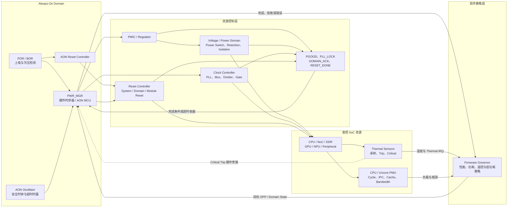
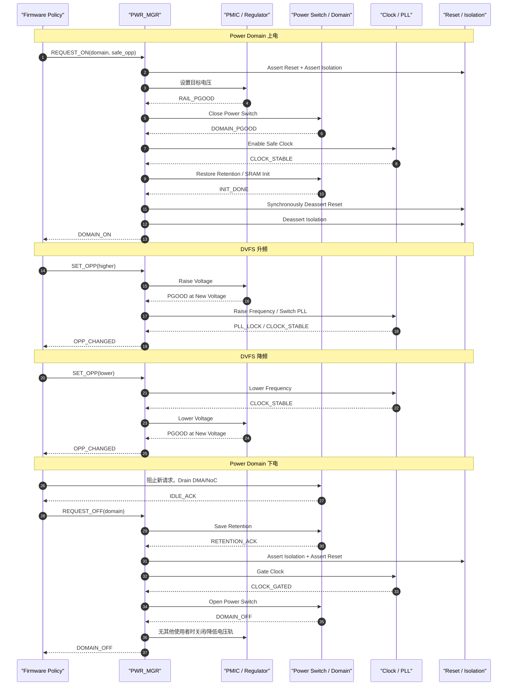
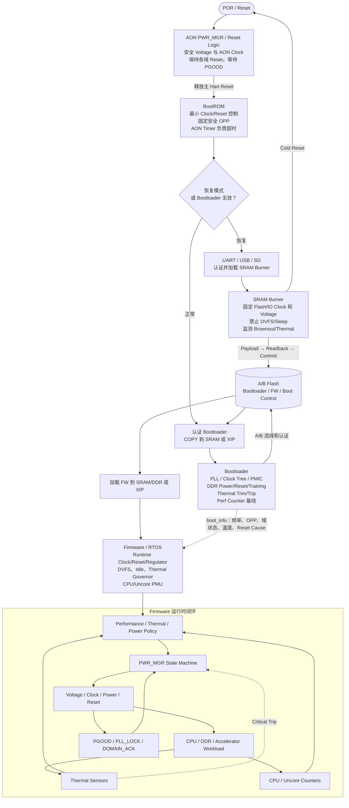

# SoC 中 Clock、Reset、Voltage Domain、Thermal、Perf Counter 与 PMU 详解

## 0. 文档范围与术语约定

本文面向通用多核 RISC-V SoC，内容同样适用于大多数 ARM、DSP、NPU 等异构 SoC。重点不是某个厂商的寄存器地址，而是这些模块的硬件含义、相互依赖、软件职责、启动阶段用法、运行期控制和验证方法。

首先统一两个容易混淆的 PMU 名称：

| 本文名称 | 常见全称 | 主要职责 |
|---|---|---|
| `PWR_MGR` | Power Management Unit / Power Manager | 电源域、Voltage、Clock、Reset、Isolation、Retention、低功耗、唤醒和 DVFS |
| `CPU_PMU` | Performance Monitoring Unit | CPU 周期、退休指令、Cache Miss、分支失败、流水线停顿等性能事件计数 |
| `UNCORE_PMU` | Uncore Performance Monitor | L2/LLC、NoC、DDR、IOMMU、GPU、NPU、DMA 等共享模块的性能计数 |

厂商资料中的 `PMU` 可能指上述任意一种。代码、日志和接口中应显式使用 `PWR_MGR`、`CPU_PMU`、`UNCORE_PMU`，不要只写一个含糊的 `pmu_init()`。

本文使用 `Voltage Domain` 的正确拼写；它与 `Power Domain`、`Clock Domain`、`Reset Domain` 并不一一对应。

## 1. 六类机制之间的核心关系

这六类机制可以分成三层：

1. 被管理资源：Voltage/Power Domain、Clock Domain、Reset Domain。
2. 安全与观测：Thermal Sensor、CPU/Uncore Performance Counter。
3. 决策与执行：Firmware Governor 制定策略，`PWR_MGR` 按硬件时序执行。



软件访问一个可掉电模块前，至少应满足：

```text
Power Good
&& Clock Running
&& Isolation Released
&& Reset Deasserted
&& Interconnect Path Available
```

只要其中一个条件不满足，MMIO 访问就可能读到无效值、产生 Bus Error，甚至让 NoC 永久等待响应。

## 2. Domain 不是一一对应关系

### 2.1 Clock Domain

由同一个时钟或同步派生时钟驱动的一组时序逻辑。一个 CPU Voltage Domain 内可以有多个 Hart Clock Domain、L2 Clock Domain 和 Debug Clock Domain。

### 2.2 Reset Domain

共享复位语义、复位源或复位释放时序的一组逻辑。即使两个模块使用同一时钟，只要 Reset 不同，也可能发生 Reset Domain Crossing，简称 RDC。

### 2.3 Voltage Domain

工作在同一电压等级、需要相同电平转换规则的一组逻辑。Voltage Domain 强调电压值和电气边界。

### 2.4 Power Domain

可以独立 Power Gate、Retention 或上下电的逻辑岛。多个 Power Domain 可以共享一个 Regulator/Voltage Rail；同一 Power Domain 也可能在多个 OPP 电压下工作。

一个典型 CPU Cluster 可以表现为：

```text
一个 CPU Voltage Domain
├── Hart0 Clock Gate + Hart0 Local Reset
├── Hart1 Clock Gate + Hart1 Local Reset
├── Hart2 Clock Gate + Hart2 Local Reset
├── Hart3 Clock Gate + Hart3 Local Reset
├── Shared L2 Clock/Reset Domain
└── Debug/AON Clock Domain
```

因此，不能把“关闭 Clock”“拉 Reset”和“关闭 Power”当成同一个操作。

## 3. Clock Domain 详解

### 3.1 典型时钟树

```text
Crystal / RC Oscillator
        ↓
      PLL/FLL
        ↓
Glitch-Free Clock Mux
        ↓
     Divider
        ↓
Integrated Clock Gate
        ↓
Clock Distribution Tree
        ↓
CPU / NoC / DDR / Peripheral
```

常见时钟包括：

- `AON/RTC Clock`：低频且持续运行，用于 PWR_MGR、Watchdog、Wake、Reset 日志和安全超时。
- `Safe Clock`：BootROM 和 PLL 失锁回退使用的晶振或 RC Clock。
- `CPU PLL`：为 Hart、L1/L2 Cache 提供高频时钟。
- `NoC Clock`：可能与 CPU 异频，通过 CDC Bridge 连接。
- `DDR PLL`：DDR Controller/PHY 使用，切换后通常需要重新训练或重新计算 Timing。
- `Peripheral Clock`：UART、SPI、I²C、Timer、USB、SD/eMMC 等功能时钟。
- `Reference Clock`：给 PLL、SerDes、PHY 或外部设备提供参考。

### 3.2 PLL、Mux、Divider 与 Clock Gate

- PLL 将低频参考时钟倍频为高频时钟，必须等待 `PLL_LOCK`。
- Clock Mux 选择父时钟；动态切换必须使用 Glitch-Free Mux。
- Divider 产生所需频率，修改时要遵循 Busy/Update/ACK 语义。
- Clock Gate 用于空闲时降低动态功耗，应使用集成门控单元，不能直接用组合逻辑与时钟相与。
- Clock Monitor 检测时钟丢失、频率越界或 PLL Unlock。

`WFI` 只是 RISC-V 体系结构提示，不等价于硬件已经关闭 Hart Clock。是否 Clock Gate 由实现和电源策略决定。

### 3.3 Clock Domain Crossing：CDC

异步 Clock Domain 之间直接传递信号会产生亚稳态。不同信号类型需要不同结构：

| 信号类型 | 推荐 CDC 结构 |
|---|---|
| 单比特稳定电平 | 两级或多级 Synchronizer |
| 单周期 Pulse | Toggle Synchronizer 或 Request/ACK Handshake |
| 多比特配置 | Bundled Data + Handshake |
| 连续数据流 | Async FIFO |
| 跨域计数器 | Gray Code + Synchronizer |
| Power/Reset 状态 | 同步器、去抖和稳定时间检查 |

禁止把多位总线的每一位分别接两级同步器，因为各位可能在不同周期稳定，组合出一个从未真实存在的值。

软件无法修复错误的 CDC 电路。软件只能在切频、Gate Clock 或关闭 Domain 前停止新请求并等待硬件 Handshake/Outstanding Counter 归零。

### 3.4 安全 PLL 切换

```text
冻结依赖方的新请求
→ 切到 Safe Clock
→ 配置 PLL
→ 等待 PLL_LOCK，并使用 AON Timer 超时
→ 配置 Divider
→ 通过 Glitch-Free Mux 切回 PLL
→ 读回实际 Clock Source/Divider
→ 更新 UART、Timer、Watchdog、Flash Timing
→ 恢复请求
```

不要只等待固定微秒数后假定 PLL 已锁定；应检查硬件状态并设置有限超时。

### 3.5 Clock 在启动流程中的应用

| 阶段 | Clock 策略 |
|---|---|
| POR/AON | 先建立 AON/Safe Clock；CPU 尚未执行软件 |
| BootROM | 使用 Safe Clock，只开启 SRAM、OTP/Crypto 和启动介质时钟 |
| SRAM Burner | 固定保守 OPP；锁定 UART/USB/Flash Clock；禁止 DFS/DVFS |
| Bootloader | 配置 PLL、NoC、DDR、Timer 和外设 Clock，建立稳定基线 |
| Firmware/OS | Runtime Clock Gating、CPUFreq、DevFreq、QoS 和低功耗 |

Flash Busy 或从 NOR XIP 运行时，不得随意改变 QSPI Source Clock、Divider 或 Dummy Cycle。DDR Clock 变化可能要求重新训练，必须由 DDR/PMU 规格明确支持。

### 3.6 常见 Clock 故障

- PLL 未 Lock 就切换，CPU/NoC 立即停止。
- Clock Mux 切换产生毛刺或窄脉冲。
- UART 切频后未更新 Baud Divider，输出乱码。
- Watchdog/Timer 时钟变了但超时参数没有更新。
- Flash XIP 时切换 Flash Clock，CPU 取到错误指令。
- 总线事务未 Drain 就 Gate Clock，形成永久 AXI/AHB Timeout。
- 把 `mcycle` 当作恒定墙钟时间，DVFS 后软件超时错误。

## 4. Reset Domain 详解

### 4.1 常见复位源

- POR：Power-On Reset。
- BOR：Brown-Out Reset，供电跌落触发。
- External Reset Pin。
- Watchdog Reset。
- Software Warm Reset。
- Security/Tamper Reset。
- Thermal Critical Reset。
- Debug Module/System Reset。
- Hart Local Reset。
- Peripheral/Domain Local Reset。
- Power Domain 重新上电时产生的 Domain Reset。

Reset Controller 通常负责复位源汇聚、屏蔽、优先级、Cold/Warm/Local 分类、Reset Tree、保持时间、Reset Cause 粘滞寄存器和各 Clock Domain 的同步释放。

### 4.2 异步断言、同步释放

常见原则是：

```text
Reset Assert：允许异步，故障时立即进入安全状态
Reset Deassert：必须在每个目标 Clock Domain 内同步
```

异步释放会让不同触发器在不同周期退出复位，引发 One-Hot 状态机非法、协议 `valid/ready` 错位或计数器异常。每个 Clock Domain 通常需要独立 Reset Synchronizer。

### 4.3 Reset Domain Crossing：RDC

RDC 常见于：

- 同一 Clock 下两个不同 Reset Domain 之间传信号。
- 一个 Domain Reset 时，另一个 Domain 仍采样其输出。
- 多条复位路径在下游重新汇合。
- Retention 恢复的旧状态与 Reset 后新状态混合。
- Clock 已 Gate，导致同步 Reset 无法释放。
- Reset Pulse 宽度不足。

常用措施：

- 每个 Clock Domain 单独同步释放 Reset。
- Reset Domain 间使用 Handshake。
- Reset 期间 Clamp `valid/request/interrupt`。
- 复位前 Drain 总线和 DMA。
- 共享状态加入 Epoch/Generation，丢弃旧事务。
- 使用静态 RDC 检查和 Reset-Aware 仿真。

### 4.4 Cold、Warm 与 Local Reset

| 类型 | 通常会复位 | 可能保留 |
|---|---|---|
| POR/Cold Reset | CPU、NoC、DDR Controller、外设、部分 PMU 状态 | OTP、AON Scratch、不可失寄存器 |
| Warm Reset | Hart、Cache、部分外设 | DRAM、AON、Reset Cause、Retention |
| Hart Local Reset | 单 Hart Pipeline/CSR | 其他 Hart、共享 L2、NoC |
| Peripheral Reset | 单个控制器 | 系统其他模块 |
| Security Reset | 密钥与安全上下文 | 由生命周期策略决定 |

RISC-V 架构不会替具体 SoC 定义所有 CSR、Cache、PLIC/APLIC/IMSIC、PMP 和 DDR 的复位状态。软件必须依据芯片 TRM，不应把 Warm Reset 当成完整上电复位。

### 4.5 局部复位流程

```text
阻止新请求
→ 停止 DMA 和中断源
→ 等待总线事务完成
→ Flush/Invalidate 必要 Cache
→ 必要时 Assert Isolation
→ Assert Reset 并保持规定周期
→ 确认目标 Clock 有效
→ 在目标 Clock Domain 同步 Deassert Reset
→ 等待 RESET_DONE / INIT_DONE
→ 释放 Isolation
→ 恢复访问
```

Isolation 与 Reset 的精确先后由 IP 协议安全值决定；硬约束是只有当输出稳定并处于协议允许状态后，才允许其他 Domain 观察它。

### 4.6 Reset 在启动流程中的应用

- BootROM 应最早读取 Reset Cause，因为某些寄存器是 clear-on-read。
- Burner 只释放 UART/USB/SD、Flash Controller 和必要 DMA；其他 Hart 和外设保持 Reset。
- Bootloader 按 NoC → DDR → Peripheral → Secondary Hart 的依赖关系释放 Reset。
- Secondary Hart 的 Boot Address、Stack、共享 Cache、IPI/中断必须先准备，最后才释放 Hart Reset。
- Firmware 负责 CPU Hotplug、设备故障恢复、Suspend/Resume 和 Watchdog Reset。
- Warm Reset 后应复核 PLL、DDR、Flash Controller、DMA 和中断 Pending 状态，初始化代码必须幂等。

## 5. Voltage Domain 与 Power Domain 详解

### 5.1 典型硬件组成

- PMIC 或片上 Regulator。
- Power Switch/Header Switch。
- Power-Good Detector。
- Level Shifter。
- Isolation Cell。
- Retention Flop/SRAM Retention。
- SRAM Light-Sleep/Deep-Sleep 控制。
- Voltage Monitor/Brown-Out Detector。
- PWR_MGR Power-State FSM。
- OPP 表和硬件安全上下限。

跨不同 Voltage Domain 的信号需要 Level Shifter。可掉电 Domain 输出到仍上电 Domain 时还需要 Isolation Cell，Clamp 值应是协议安全值，例如 `valid=0`、`request=0`、中断非触发态。

### 5.2 电源状态

常见状态并不仅有 ON/OFF：

```text
ON / Active
Clock Gated
Idle
Retention
SRAM Light Sleep
Power Gated
Deep Power Down
```

每个状态必须定义：哪些寄存器、Cache、TLB、SRAM 和 Counter 保留；哪个 Clock 继续运行；可用 Wake Source；恢复延迟；DDR 是否需要重新训练。

### 5.3 Power Domain 上电、下电与 DVFS



不同芯片的 Power Switch、Reset、Isolation 先后可能略有不同，必须以 UPF、IP Integration Guide 和 TRM 为准。完成条件应使用 `PGOOD/ACK/LOCK`，并配套 AON Timer 超时。

### 5.4 OPP 与 DVFS

OPP（Operating Performance Point）将电压与最高合法频率绑定：

| 示例 OPP | Voltage | 最大频率 | 典型用途 |
|---|---:|---:|---|
| Safe | 低 | 低 | BootROM、Recovery、故障回退 |
| Nominal | 中 | 中 | 日常运行 |
| Turbo | 高 | 高 | 温度、功率和电流允许时短时 Boost |

动态功耗近似：

```text
Pdynamic ≈ α × C × V² × f
```

频率增加通常还要求提高电压，因此功耗增长可能明显快于频率。高温又会增加 Leakage，形成热正反馈。

DVFS 必须遵循：

```text
升频：先升 Voltage → 等待稳定 → 再升 Clock
降频：先降 Clock → 确认生效 → 再降 Voltage
```

PWR_MGR 应拒绝低电压高频率、超过 Temperature Derating、超过 Speed Bin 或生命周期限制的非法组合。

### 5.5 UPF 与 Power-Aware 验证

UPF 通常描述：

- Power Domain、Supply Net、Supply Set。
- Power Switch。
- Isolation Strategy。
- Retention Strategy。
- Level Shifter Strategy。
- Power State Table。
- Domain 间合法电压组合。

关键断言包括：

- Domain Off 前 Isolation 已生效。
- Reset 释放时 Clock 和 Power 稳定。
- Domain Off 时禁止发起总线请求。
- Retention Restore 只能在主电源稳定后进行。
- 当前频率不得超过当前 Voltage 对应的 OPP 上限。
- PLL Unlock 时使用者必须切回 Safe Clock 或进入 Reset。

## 6. Thermal 子系统详解

### 6.1 温度采样链

```text
On-Die Sensor
→ ADC / Digital Conversion
→ eFuse / Factory Calibration
→ 转换为 m°C
→ 滤波
→ Thermal Zone
→ Trip / Governor
→ DVFS、Clock Throttle、Reset 或 Power-Off
```

传感器可能基于二极管、BJT、环形振荡器或其他工艺结构。Raw Code 必须使用本芯片校准参数转换，不能把未经校准的 ADC Code 直接当成摄氏度。

规格至少应定义：

- 温度单位，推荐毫摄氏度 `m°C`。
- 有效范围、精度和采样时间。
- 校准来源和公式版本。
- 传感器所在热点和 Thermal Zone。
- 失效码、饱和、超时和 Clock/Power 依赖。
- Trip 阈值、滞回和硬件动作。

### 6.2 Thermal Trip 层次

| 级别 | 典型动作 |
|---|---|
| Warning/Passive | 限制 Boost、降低 OPP、降低 GPU/NPU 并发 |
| Hot/Throttle | 强制最低安全 OPP、Clock Divide、关闭高功耗模块 |
| Critical | AON 硬件直接触发 Reset 或 Power-Off |

Critical Trip 不应依赖 OS 线程调度，也不应允许普通 Firmware 永久关闭。

### 6.3 滤波、滞回与热点

单次温度采样容易受噪声影响。常见方法包括指数滤波、滑动平均、中位数或连续 N 次越限确认。例如：

```text
filtered = α × new_sample + (1 - α) × old_filtered
```

进入和退出阈值应分离：

```text
温度 ≥ 95°C：进入降频
温度 ≤ 90°C：允许恢复
```

恢复 OPP 还应限制上升速率，避免温度在阈值附近反复振荡。CPU、GPU、NPU、DDR PHY 等热点应建立独立 Thermal Zone，不能只看全芯片平均温度。

### 6.4 Thermal 在启动和运行中的职责

| 阶段 | Thermal 职责 |
|---|---|
| AON/POR | Critical Trip、Brownout 等硬件安全旁路持续有效 |
| BootROM | 最多做极端温度/传感器状态检查，不运行复杂 Governor |
| Burner | 烧写前和长擦写中监测温度；越限后不启动下一条命令，不提交 Valid |
| Bootloader | 读取 eFuse Trim，校准传感器，建立初始 Trip 和安全 OPP |
| Firmware/OS | Thermal Governor、风扇、DVFS、功率预算、限频和关机策略 |

Flash Busy 时发生过温，不应立即切断正在编程的 Flash Domain。应让当前命令进入器件规定的可安全停止点，不再启动下一条命令，并禁止写入有效标志或 Boot Control Commit。

## 7. Performance Counter 与 CPU/Uncore PMU

### 7.1 RISC-V CPU Performance Counter

常见 CSR：

| CSR | 含义 |
|---|---|
| `mcycle` | Machine 模式周期计数 |
| `minstret` | 已退休指令计数 |
| `mhpmcounter3`～`mhpmcounter31` | 实现定义的硬件性能计数器 |
| `mhpmevent3`～`mhpmevent31` | 对应计数器的事件选择 |
| `mcountinhibit` | 停止指定计数器计数 |
| `mcounteren` | 控制低权限模式访问计数器 |
| `scounteren` | S 模式进一步控制 U 模式访问 |
| `cycle/time/instret` | 低权限只读别名，是否可访问取决于授权 |

部分实现没有完整数量的 HPM Counter，未实现的计数器可能恒为 0。`mhpmeventN` 的事件编码通常由芯片厂商定义，不能跨 SoC 直接复制。

### 7.2 重要语义

- `cycle` 通常跟随 Hart/Core Clock，不是固定墙钟时间。
- `time` 通常来自平台 Timebase，但仍应确认它是否位于 AON Domain、Sleep 时是否继续。
- `instret` 统计退休指令，不等于取指数或内部微操作数。
- `mcounteren/scounteren` 控制访问权限，不等同于停止底层计数。
- Counter 可能在 WFI、Clock Gating、Core Reset 或 Power Gating 时停止或清零。
- 多 Hart SoC 中，CPU PMU 通常每 Hart 独立。
- 支持 `Sscofpmf` 等扩展时可提供溢出中断和模式过滤，但必须先发现能力。

### 7.3 RV32 读取 64 位 Counter

RV32 需要高—低—高一致性读取：

```c
uint64_t read_mcycle64_rv32(void)
{
    uint32_t hi1;
    uint32_t lo;
    uint32_t hi2;

    do {
        hi1 = read_csr(mcycleh);
        lo  = read_csr(mcycle);
        hi2 = read_csr(mcycleh);
    } while (hi1 != hi2);

    return ((uint64_t)hi1 << 32) | lo;
}
```

### 7.4 常用派生指标

```text
IPC  = retired_instructions / cycles
CPI  = cycles / retired_instructions
L1D MPKI = L1D_misses × 1000 / retired_instructions
Branch MPKI = branch_mispredicts × 1000 / retired_instructions
Stall Ratio = stall_cycles / total_cycles
Bandwidth = delta_count × bytes_per_event / sample_time
```

DVFS 前后比较性能时，不能只看 Cycle。应结合墙钟时间、实际频率、退休指令、Cache Miss、Stall 和 DDR/NoC Bandwidth。

### 7.5 Uncore PMU

Uncore 包括：

- L2/LLC。
- NoC/AXI Interconnect。
- DDR Memory Controller。
- IOMMU。
- PCIe。
- GPU/NPU/DSP。
- DMA 和 QoS Controller。

典型事件：L2 hit/miss、NoC flit、拥塞周期、DDR read/write、Row Hit、队列延迟、IOMMU TLB Miss、GPU/NPU Busy Cycle、DMA Outstanding、QoS Throttle 和 ECC Error。

每个 Uncore Counter 必须说明：

- 位宽和溢出行为。
- 单位是 Event、Request、Beat、Byte 还是 Cycle。
- 是否支持 Snapshot/Latch。
- 所属 Clock/Reset/Power Domain。
- Sleep/Reset/Power-Off 时是否停止或丢失。
- 是否能按 Master、Channel、VMID、Privilege 或 Address Range 过滤。

看到一个名为 `DDR_WRITE_COUNT` 的寄存器，不能默认一次计数等于一个字节。

### 7.6 Counter 在各阶段中的用途

| 阶段 | 典型用途 |
|---|---|
| BootROM | 通常不启用复杂 HPM；安全超时使用 AON Timer |
| Burner | 可统计传输/烧写吞吐，但不得参与 Voltage/Thermal 安全判断 |
| Bootloader | 清零或快照启动阶段 Counter；发现 PMU 能力并配置访问权限 |
| Firmware/RTOS | 负载估计、DVFS、调度、QoS、性能诊断和功率模型 |
| OS/Hypervisor | `perf` 事件、Counter Multiplex、Guest 虚拟化和上下文切换 |

### 7.7 Perf Counter 常见陷阱

- 用 `mcycle` 做 PLL、PMIC、Flash 或 Power Domain 的安全超时。
- RV32 非原子读取 64 位 Counter。
- 没有处理 Counter Overflow。
- Counter Multiplex 后未按 Active Time 缩放。
- 把厂商 Event ID 当作通用 RISC-V Event。
- 只看 CPU PMU，却用它推断 DDR/NoC 瓶颈。
- 忽略 Counter 在 Sleep/Reset/Power-Off 中的行为。
- 多个 Profiler 争用同一 Counter，没有仲裁。
- 允许低权限软件观察安全上下文事件，形成 Cache/Timing Side Channel。

## 8. PWR_MGR：Power Management Unit

### 8.1 典型组成

PWR_MGR 通常位于 Always-On Domain，可能是硬件 FSM、AON MCU/SCP，也可能两者组合。它通常管理：

- Power Switch、PGOOD、Isolation、Retention。
- PMIC/I²C/SPI/专用 Voltage Interface。
- PLL、Clock Source、Divider、Clock Gate。
- Reset Controller。
- Wake Source、RTC、Watchdog、AON Timer。
- CPU、Cluster、DDR、NoC、Peripheral 的低功耗 Handshake。
- Brownout、过流、Thermal 告警和硬件安全 OPP。

PWR_MGR 不应只是允许任意软件写入的寄存器集合。生产实现应具有 OPP 白名单、硬件上下限、转换状态机、超时、安全回退和错误日志。

### 8.2 软件策略与硬件执行分工

```text
Firmware Governor：决定“想要什么”
PWR_MGR：可靠执行“如何切换”
```

例如 Firmware 请求 CPU 进入 OPP3；PWR_MGR 检查 Thermal Cap、Speed Bin、Voltage 上限和 Domain 依赖，然后执行升压、等待 PGOOD、切 PLL、等待 Lock，最后返回成功或失败。

### 8.3 低功耗层次

```text
Run
├── Active
├── Clock Gated
└── DVFS OPP0..OPPn

CPU/Cluster Idle
├── WFI
├── Core Clock Gated
├── Core Retention
└── Core Power Gated

System Sleep
├── Cluster Retention
├── DDR Self-Refresh
├── SoC Retention
└── Deep Power Down
```

每个状态必须定义进入/退出延迟、可用 Wake Source、上下文保存位置、DDR 行为和 Counter 连续性。

### 8.4 深睡进入与恢复

进入：

```text
冻结新任务和 DMA
→ 等待总线事务完成
→ 保存上下文
→ Flush Cache
→ 配置 Wake Source
→ Park Secondary Harts
→ DDR Self-Refresh
→ 保存/停止 Performance Counters
→ Retention Save
→ Assert Isolation
→ Gate Clock
→ Power Gate
```

恢复：

```text
Power On
→ 等待 PGOOD
→ 恢复 Safe Clock
→ Retention Restore
→ 同步释放 Reset
→ 解除 Isolation
→ DDR Exit Self-Refresh
→ 恢复上下文和 Counter
→ 清理 Wake Pending
→ 释放 Secondary Harts
```

### 8.5 PWR_MGR Mailbox

若由独立 AON MCU 管理电源，主 CPU 通常通过 Mailbox 请求：

```text
REQUEST(domain, target_state, target_opp, transaction_id)
→ ACK_ACCEPTED
→ 状态机执行
→ COMPLETE(transaction_id, actual_state)
或 ERROR(transaction_id, reason)
```

Mailbox 请求是异步事务，必须有 Transaction ID、超时、重复请求语义和 PMU Firmware/Protocol Version 检查。

## 9. 在 BootROM、Burner、Bootloader、Firmware 流程中的运用



### 9.1 各阶段资源所有权

| 阶段 | Clock | Reset | Voltage/PWR_MGR | Thermal | Perf Counter |
|---|---|---|---|---|---|
| AON/POR | 建立 Safe/AON Clock | 产生 POR、保持各域 Reset | 拉起最小电源，等待 PGOOD | Critical 硬件保护 | AON Timer 可开始 |
| BootROM | 最小启动 Clock | 只释放主 Hart 和启动外设 | 固定 Safe OPP | 最小检查 | 通常不配置 HPM |
| Burner | 固定传输/Flash Clock | 无关域保持 Reset | 强制 RUN，禁止 DVFS/Sleep | 擦写窗口监测 | 仅诊断吞吐 |
| Bootloader | 配置 PLL/NoC/DDR | 按依赖释放 DDR/外设/从核 | 建立初始 OPP 和 Domain Graph | 校准并设置 Trip | 清零/快照/权限 |
| Firmware | Runtime Gating/DVFS | 设备恢复、Hotplug、Suspend | Runtime PM、Retention、Wake | Governor/Throttle/Shutdown | 采样、复用、调优 |

## 10. Firmware 运行时控制闭环

最终 OPP 是多个约束的交集：

```text
target_opp = min(
    performance_requested_opp,
    thermal_max_opp,
    power_cap_opp,
    regulator_max_opp,
    speed_bin_max_opp,
    lifecycle_max_opp)
```

CPU_PMU 提供“工作负载是否需要更高性能”，Uncore PMU 提供“瓶颈是否在 NoC/DDR”，Thermal 提供“当前最高安全 OPP”，PWR_MGR 负责实际切换。

典型控制周期：

```text
采集 AON Time、CPU/Uncore Counter、Temperature
→ 计算 IPC、MPKI、Bandwidth、Utilization
→ 应用 Thermal/Power/Current Cap
→ 选择目标 OPP
→ PWR_MGR 执行转换
→ 检查 PGOOD/PLL_LOCK/ACK
→ 记录实际 OPP 与错误
→ 下一周期重新采样
```

所有 OPP 转换必须序列化。Thermal ISR、Scheduler、CPUFreq、GPU Driver 和用户接口不能同时直接写同一组 PMIC/PLL 寄存器。

## 11. 安全的参考伪代码

### 11.1 Power Domain 上电

```c
int power_domain_on(enum domain_id domain, uint32_t timeout_us)
{
    reset_assert(domain);
    isolation_assert(domain);

    pwr_mgr_request_on(domain);
    if (wait_aon_timeout(domain_pgood, domain, timeout_us) != 0)
        return ERROR_POWER_GOOD;

    clock_enable_safe(domain);
    if (wait_aon_timeout(clock_stable, domain, timeout_us) != 0)
        return ERROR_CLOCK;

    retention_restore(domain);
    reset_deassert_synchronized(domain);
    if (wait_aon_timeout(domain_init_done, domain, timeout_us) != 0)
        return ERROR_INIT;

    isolation_deassert(domain);
    return 0;
}
```

### 11.2 DVFS

```c
int set_opp(const struct opp *current, const struct opp *target)
{
    int result = 0;

    lock_dvfs_transition();

    if (!opp_allowed_by_speedbin_and_thermal(target)) {
        result = ERROR_OPP_NOT_ALLOWED;
        goto out;
    }

    if (target->frequency_hz > current->frequency_hz) {
        result = regulator_set_and_wait(target->voltage_uv);
        if (result == 0)
            result = clock_set_and_wait(target->frequency_hz);
    } else {
        result = clock_set_and_wait(target->frequency_hz);
        if (result == 0)
            result = regulator_set_and_wait(target->voltage_uv);
    }

    if (result != 0)
        pwr_mgr_enter_safe_opp();

out:
    unlock_dvfs_transition();
    return result;
}
```

### 11.3 Thermal 与 Counter 采样

```c
void governor_sample(void)
{
    uint64_t now = aon_time_ticks();
    uint64_t cycles = cpu_pmu_read_cycles();
    uint64_t instructions = cpu_pmu_read_instret();
    uint64_t ddr_bytes = uncore_pmu_read_ddr_bytes();
    int32_t temperature_mc = thermal_read_millicelsius();

    struct metrics metrics = metrics_from_deltas(
        now, cycles, instructions, ddr_bytes, temperature_mc);

    uint32_t requested = performance_policy(&metrics);
    uint32_t thermal_cap = thermal_max_opp(temperature_mc);
    uint32_t target = min_u32(requested, thermal_cap);

    pwr_mgr_request_opp(target, AON_TIMEOUT_US);
}
```

安全判断不能仅依赖 Performance Counter；Brownout、PGOOD、PLL Lock、Thermal Critical 和 Flash Busy 都必须来自相应硬件状态。

## 12. Bootloader 到 Firmware 的交接信息

建议通过版本化 `boot_info` 传递：

```text
magic / version / size / crc
chip_id / board_id / revision / lifecycle
reset_reason / wake_reason
current_cpu_opp / actual_cpu_hz / actual_ddr_hz
timebase_frequency
active_power_domain_mask
released_reset_domain_mask
pll_lock_mask
thermal_calibration_version
boot_temperature_mc / thermal_status
cpu_pmu_capability / uncore_pmu_capability
counter_preserved_or_cleared
watchdog_owner / deadline
secondary_hart_state
secure_boot_result / boot log address
```

下一阶段仍应读取关键硬件寄存器确认实际状态，不能完全相信上一阶段的软件缓存，尤其是 Warm Reset 后。

## 13. 安全性与权限

### 13.1 PWR_MGR 安全

- 普通应用不得直接设置任意 Voltage/Frequency。
- OPP 表应来自可信 Firmware 或签名配置。
- 硬件应限制最高 Voltage、Frequency 和变化速率。
- Critical Thermal、Brownout 和过流保护不能由普通 OS 禁用。
- 电压故障、Clock Glitch 和非法 OPP 应留下可审计 Reset Reason。
- 关闭 Power Domain 前应确认其中没有安全关键任务或 DMA。

### 13.2 Performance Counter 安全

Counter 可能泄漏 Cache、分支和执行时序信息：

- 使用 `mcounteren/scounteren` 限制低权限访问。
- Hypervisor 应虚拟化或 Context Switch Counter。
- Secure/Non-Secure 切换时冻结、清零或按权限过滤。
- Uncore Master/VMID/Address Filter 只能由特权软件配置。
- 高频采样接口需要防止 Timing Side Channel。

## 14. 故障现象与定位

| 现象 | 典型原因 | 优先检查 |
|---|---|---|
| 切 PLL 后立即死机 | 未 Lock、Mux 毛刺、Divider 非法 | PLL_LOCK、Clock Monitor、Mux ACK |
| UART 切频后乱码 | Baud Divider 未更新 | UART Parent Clock 和 Divider |
| 偶发状态机跑飞 | Reset 异步释放或 RDC | Reset Synchronizer、RDC 报告 |
| Secondary Hart 不启动 | Clock 未开、Reset 未释放、Mailbox/Cache 问题 | Hart Clock/Reset、Boot Address、IPI |
| 仅 Cold Boot 失败 | Power Ramp、POR、DDR Training | PGOOD、PLL、DDR Log |
| 仅 Warm Reset 失败 | Retention、DMA、Interrupt Pending | Reset Domain 和保留状态 |
| Flash 擦写偶发失败 | Brownout、过温、Flash Clock 过高 | PMIC 波形、BOR、QSPI Timing |
| DDR 随机错误 | Voltage/Clock 顺序或 Training 失效 | DDR PLL、PHY、ECC |
| NoC 永久 Busy | Power-Off 前事务未 Drain | Outstanding Counter、Isolation |
| 唤醒后中断风暴 | Interrupt Source/Controller Reset 不一致 | PLIC/APLIC/IMSIC Pending |
| 功耗明显偏高 | Clock Gate 或 Power Switch 未生效 | Gate ACK、PGOOD、Rail Current |
| OPP 附近频繁抖动 | Thermal 无 Hysteresis | Trip、Filter、Governor Log |
| 性能计数器停滞 | `mcountinhibit`、Clock Gate、Power-Off | CSR、Clock/Power State |
| 时间跳变 | 将 `mcycle` 当持续墙钟 | `time/mtime` 或 AON Timer 来源 |
| DVFS 偶发崩溃 | 升频前未升压或降压过早 | OPP Log、PMIC Ramp、PLL State |

## 15. 可观测性设计

AON Domain 建议保留：

- 原始和解析后的 Reset/Wake Cause。
- 当前 Power State 和每个 Domain 的 PGOOD。
- Isolation、Reset、Clock Gate 状态。
- PLL Lock、Clock Source、Divider 和测频结果。
- PWR_MGR FSM 当前状态、Transaction ID 和最近错误。
- Regulator 目标值、实际值或 ACK。
- Thermal Sample、Trip、Critical 状态。
- NoC Outstanding Transaction Counter。
- 每个 Hart 的 Clock、Reset、WFI、Alive 状态。
- 最近若干次状态转换的 AON 时间戳环形日志。

启动阶段可以写入 AON Scratch Marker：

```text
0x10：BootROM 入口
0x20：Burner 已认证
0x30：Flash 安装开始
0x40：Bootloader 入口
0x50：PLL 已锁定
0x60：DDR Training 完成
0x70：Firmware 已认证
0x80：Firmware Handoff
0x90：Firmware Runtime Ready
```

即使 DDR 和 UART 都不可用，也可通过 JTAG 或下次启动读出最后成功阶段。

## 16. 验证矩阵

| 测试域 | 必测内容 |
|---|---|
| Clock/CDC | PLL 切换、Mux、Gate、异步 FIFO、Pulse/Handshake、Clock Loss、动态切频 |
| Reset/RDC | 异步释放、不同 Reset Domain、Warm/Cold/Local、Reset Pulse、Clock-Gated Reset |
| UPF/Power | Isolation、Level Shifter、Retention、非法 Power State、X Propagation |
| DVFS | 每对相邻 OPP 升降、Voltage/Frequency 顺序、并发请求、失败回退 |
| Thermal | 温箱、校准误差、Trip、Hysteresis、采样延迟、Sensor stuck/open/saturation |
| CPU PMU | Cycle/Instret/HPM、事件映射、Overflow、RV32 原子读取、权限 |
| Uncore PMU | L2/NoC/DDR 压测、单位、Snapshot、Clock/Reset/Power 行为 |
| 低功耗 | 每个 Idle/Suspend 状态、Wake Source、Retention、DDR、Counter 连续性 |
| 故障注入 | PLL 不锁、PMIC 无 ACK、PGOOD 卡住、Reset stuck、Brownout、Critical Thermal |
| 多核 | Hart Park/Release、IPI、Cache、共享 Counter、并发 DVFS |
| 安全 | CSR/MMIO 权限、Guest 隔离、Counter Side Channel、非法 OPP、Trip 不可绕过 |
| 长稳 | 高频 OPP 切换、Suspend/Resume、热循环、电压角、老化场景 |

硬件设计侧还应完成：

```text
CDC Static Signoff
→ RDC Static Signoff
→ UPF Static Check
→ RTL Power-Aware Simulation
→ X Propagation
→ Retention Save/Restore
→ Gate-Level Power-Aware Simulation
→ HIL Fault Injection
```

## 17. 最终设计检查清单

- [ ] 每个 Clock Domain 的 Source、范围、切换条件、ACK 和超时已定义。
- [ ] 每个 Reset 的影响范围、保持时间、同步释放和保留状态已定义。
- [ ] 每个 Voltage/Power Domain 的依赖、Isolation、Retention 和上下电时序已定义。
- [ ] 每个 OPP 的 Voltage、Frequency、温度范围、Ramp Time 和 Speed Bin 已定义。
- [ ] PWR_MGR 与 CPU/UNCORE PMU 的术语和 API 已彻底区分。
- [ ] BootROM、Burner、Bootloader、Firmware 的资源所有权没有重叠控制者。
- [ ] 所有 PGOOD、PLL_LOCK、DOMAIN_ACK、DDR、Flash Busy 等等待都有 AON Timer 超时。
- [ ] Burner 使用固定安全 OPP，禁止 DVFS、Deep Sleep 和 Flash Clock 切换。
- [ ] Critical Thermal 不依赖普通软件调度。
- [ ] Perf Counter 的位宽、单位、Clock/Reset/Power 行为和权限可测试复现。
- [ ] Warm Reset、Retention、Secondary Hart、DMA 和 Interrupt Pending 已纳入交接协议。
- [ ] CDC/RDC/UPF 的任何豁免都有设计依据和回归用例。
- [ ] 任一资源转换失败都能回到安全 OPP、已知隔离状态或受控 Reset。

## 18. 一句话总结

Clock 决定逻辑何时工作，Reset 决定逻辑从什么状态开始，Voltage/Power Domain 决定逻辑是否具备供电条件；Thermal 给出不可突破的安全边界，Performance Counter 提供性能观测，PWR_MGR 则把 Firmware 的策略可靠地转换成 Voltage、Clock、Reset、Isolation 和 Power State 的硬件时序。
