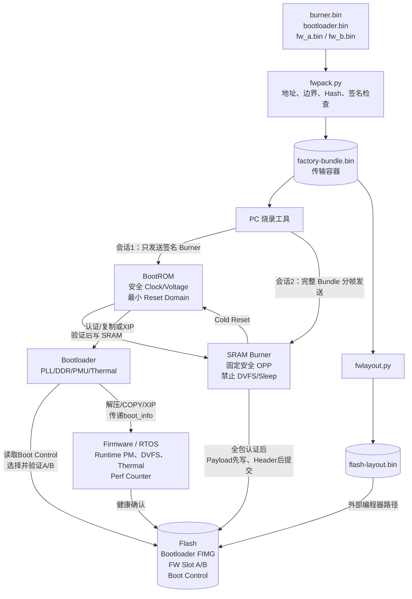

已完成细化与实现，包含打包、UART/USB/SD 两阶段传输、BootROM/Burner/Bootloader/FW、A/B 启动、硬件资源时序及参考代码。

交付文件：

- [完整参考实现压缩包](/C:/Users/BlueMoon/Documents/Codex/2026-08-21/new-chat-3/outputs/firmware-package-reference-v2.zip)
- [详细启动数据流与硬件管理文档](/C:/Users/BlueMoon/Documents/Codex/2026-08-21/new-chat-3/outputs/firmware-package-reference/详细启动数据流与硬件管理.md)
- [运行说明](/C:/Users/BlueMoon/Documents/Codex/2026-08-21/new-chat-3/outputs/firmware-package-reference/README.md)
- [完整字节流图](/C:/Users/BlueMoon/Documents/Codex/2026-08-21/new-chat-3/outputs/firmware-package-reference/diagrams/05-complete-byte-flow.mmd)
- [硬件资源启动时序图](/C:/Users/BlueMoon/Documents/Codex/2026-08-21/new-chat-3/outputs/firmware-package-reference/diagrams/06-resource-aware-boot-sequence.mmd)
- [UART 两阶段协议图](/C:/Users/BlueMoon/Documents/Codex/2026-08-21/new-chat-3/outputs/firmware-package-reference/diagrams/07-uart-two-session-protocol.mmd)

````

````

关键实现如下：

- `factory-bundle.bin` 是传输容器，不能直接写入 Flash。
- BootROM 会话只接收 Burner 描述符、签名和 Payload；Burner 只驻留 SRAM。
- Burner 启动后建立新 Session，接收完整 Bundle 到不可变 staging，再进行认证和安装。
- UART/USB 帧采用 32 字节头、最大 1024 字节 Payload、Session ID、Sequence、Header/Payload CRC、ACK/NACK 和幂等重传。
- Burner 使用明确且不越分区的物理擦除计划。
- Bootloader/FW Payload 先写入并回读，FIMG Header、Valid 和 Boot Control 最后提交。
- Bootloader 将镜像来源绑定到固定分区和 Slot，完成 A/B 选择、验证、加载与 `boot_info` 交接。
- `flash-layout.bin` 已实现，供外部编程器按真实 Flash offset 写空片。

硬件概念在流程中的职责：

| 概念           | 含义与关键要求                                               |
| -------------- | ------------------------------------------------------------ |
| Clock Domain   | 同一同步时钟区域；切 PLL 前切安全时钟，跨域需 CDC，Flash Busy/XIP 时禁止换时钟 |
| Reset Domain   | 一组复位范围；通常异步拉低、同步释放，必须在 Power/Clock 稳定后释放 |
| Voltage Domain | 可独立供电的电源岛；需要 PGOOD、Isolation、Level Shifter 和 Retention |
| Thermal        | Bootloader 校准并设置硬件 Trip，FW 运行 Thermal Governor；Burner 过温时禁止开始下一次擦写 |
| Perf Counter   | `mcycle/minstret/mhpmcounterN` 等，仅作性能分析；安全超时必须使用 AON Timer |
| PMU            | 文档区分 `PWR_MGR` 电源管理单元与 `PMU_COUNTERS` 性能监控单元，避免混用 |

验证结果：

- Python 9 项测试全部通过，包括 Ed25519、篡改检测、Flash layout、乱序、重传和双 Session。
- 所有目标端 C 文件通过严格 C11 编译检查。
- Transport、Burner/Loader 策略、A/B Boot Control 三组 C 可执行测试全部通过。
- 端到端签名演示成功生成 7 镜像 Bundle、68 个 ROM 下载帧、288 个 Burner 安装帧和 32 MiB Flash layout。

真实上板前仍需用芯片厂商的 Mask ROM 下载 ABI、ROM Header、Memory Map、PMIC/PLL/Reset/DDR 时序和可信密钥替换参考接口。


