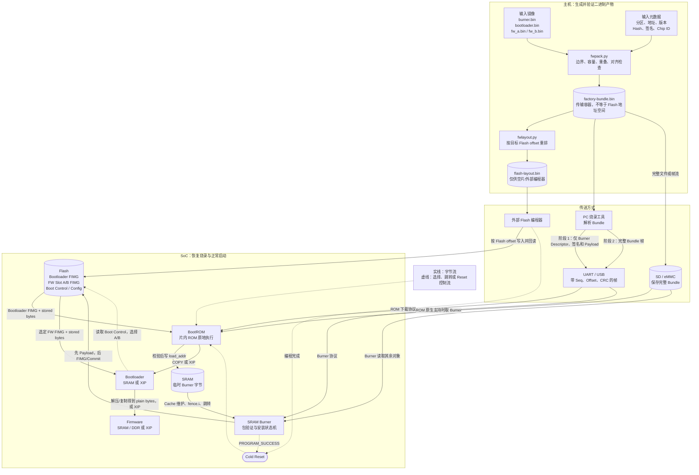
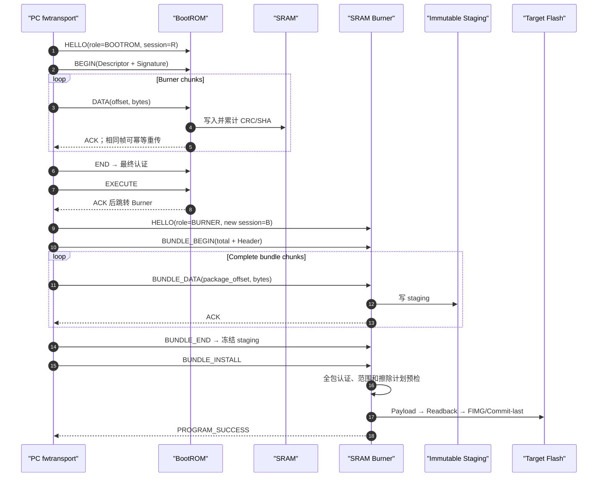
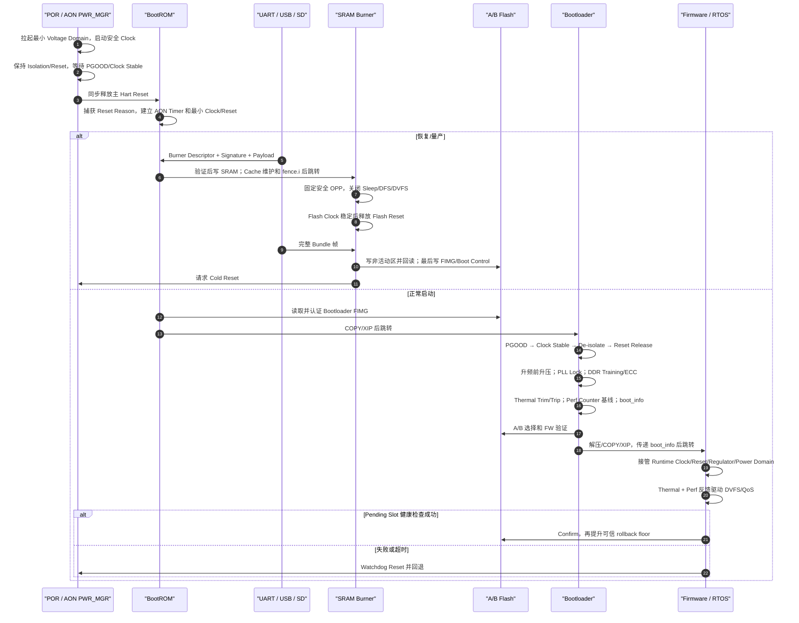

# BootROM、Burner、Bootloader、Firmware：完整数据流与硬件管理

## 0. 适用范围与最重要的边界

本文把构建、打包、UART/USB/SD 下载、Flash 安装、正常启动、A/B 回退和 Firmware 运行期管理连接成一条完整链路。它是可执行的参考协议和参考代码，不是某颗芯片已经固化的 Mask ROM ABI；接入真实芯片时，ROM Header、下载命令、可信密钥、地址和寄存器时序必须替换为芯片手册规定的格式。

完整链路分为两条：

```text
恢复/量产：POR → BootROM → UART/USB/SD 下载 Burner → SRAM Burner
          → 安装 Bootloader/FW 到 Flash → Cold Reset

正常启动：POR → BootROM → 验证/加载 Bootloader → Bootloader 初始化平台
          → A/B 选择和验证 FW → FW 运行 → 健康确认
```

必须先明确：

- BootROM 固化在片内 ROM，永远不在打包文件中，也不存在“把 BootROM 加载到芯片”。
- 工厂包中包含 Burner，只表示 PC 工具可以从包中取出它；Burner 正常情况下不写入 Flash。
- `factory-bundle.bin` 是传输容器，不等于 Flash 地址空间镜像，不能直接 `dd` 到 Flash。
- `flash-layout.bin` 才是按真实 Flash offset 展开的离线编程镜像，只适合空片/工厂全片编程。

## 1. 四种二进制产物

| 产物 | 谁生成 | 字节组织 | 最终去向 |
|---|---|---|---|
| `burner.bin` | Burner ELF 经 `objcopy` | SRAM 可执行的纯 Payload | ROM 下载到 SRAM，复位后消失 |
| `bootloader.bin`、`fw_a.bin`、`fw_b.bin` | 各自 ELF 经 `objcopy` | 单组件 plain bytes | 打包后成为 stored payload；最终进入 Flash 分区 |
| `factory-bundle.bin` | `fwpack.py` | Package Header、描述符表、签名、对齐后的 Payload | PC/Burner 解析；通常不原样存入启动分区 |
| `flash-layout.bin` | `fwlayout.py` | 每个组件已经放到实际 Flash offset，空洞填 `0xff` | 外部编程器写空片，绕过 ROM 下载和 Burner |

其中组件可能有两种长度：

- `plain_size`：链接器产生、最终执行或装载到内存的长度。
- `stored_size`：压缩/加密后存入包和 Flash 的长度。

非 XIP Firmware 的数据变化是：

```text
firmware ELF
→ objcopy 得到 plain firmware.bin
→ packer 压缩得到 stored payload
→ Burner 将 stored payload 写入 FW Slot
→ Bootloader 验签并解压/复制
→ DDR/SRAM 中恢复为 plain executable bytes
```

## 2. Bundle 中每类字节的去向

| Bundle 数据 | ROM 是否读取 | Burner 如何使用 | Flash 中是否保留 | 正常启动消费者 |
|---|---:|---|---:|---|
| Package Header | 否 | 获取包长、Chip ID、描述符位置和包级签名信息 | 通常不保留 | 无 |
| Manifest/Image Table | 仅取 Burner Descriptor 的 ROM 适配版本 | 决定对象类型、目标 offset、Slot、load/entry、Hash 和签名 | 转换为 FIMG 字段或安装策略，不原样保留 | Loader 读取 FIMG |
| Burner Payload | 是 | 已经作为当前程序运行 | 否 | 无 |
| Bootloader stored payload | 否 | 写入 Bootloader 分区的 `FIMG+256` | 是 | BootROM |
| FW A/B stored payload | 否 | 写入对应 FW Slot 的 `FIMG+256` | 是 | Bootloader |
| 镜像 Ed25519 Signature | Burner 的签名由 ROM 使用 | 写入对应 FIMG Header | 是 | ROM/Bootloader |
| Partition/Factory Config | 否 | 写入专用数据分区 | 是 | Bootloader/FW；生产方案应另加认证记录 |
| Boot Control | 否 | 最后提交，且应管理两个 erase-block 副本 | 是并可更新 | Bootloader/FW 健康确认逻辑 |

可执行分区的最终形态是：

```text
flash_offset
┌────────────────────────────────┐
│ FIMG Header，256 B             │  ← 最后写，作为镜像有效提交
│ type/slot/version/load/entry   │
│ stored/plain size/hash/signature│
├────────────────────────────────┤
│ stored payload                 │  ← 先写并回读验证
└────────────────────────────────┘
```

Package offset 只表示对象位于 `factory-bundle.bin` 的哪个位置；Flash offset 才表示它应该安装到芯片 Flash 的哪里。二者绝不能混用。

## 3. 完整字节流



## 4. UART/USB/SD 参考传输协议

### 4.1 帧格式

参考实现使用相同的 `FWFR v1` 帧承载 UART、USB 和离线 SD 帧流：

```text
32-byte Header
┌──────────────────────────────────────────┐
│ magic="FWFR"                            │
│ version/header_size/message_type/flags   │
│ session_id                               │
│ sequence                                 │
│ payload_size                             │
│ argument0 + argument1（组成 uint64 offset）│
│ header_crc32                             │
├──────────────────────────────────────────┤
│ payload，0..1024 B                       │
├──────────────────────────────────────────┤
│ payload_crc32，4 B                       │
└──────────────────────────────────────────┘
```

协议规则：

- `session_id` 隔离复位前后的旧会话，不能只按 Sequence 接受数据。
- `sequence` 从 0 单调递增；UART/USB 使用 stop-and-wait ACK/NACK。
- `argument0/argument1` 对 DATA 帧表示目标对象内的 64 位 offset。
- 相同 Sequence 的重复帧只能作为幂等重传接受；其他乱序帧 NACK。
- Header CRC 和 Payload CRC 只检测链路噪声；最终 SHA-256、签名和防回滚负责安全认证。
- ACK 必须真正发出 UART/USB 后，BootROM 才能执行 Burner；否则主机可能一直等待一个已经不会到来的 ACK。

### 4.2 第一会话：BootROM 只接收 Burner

```text
HELLO(role=BOOTROM)
→ ROM_BEGIN_IMAGE(Burner Descriptor + 64 B Signature)
→ ROM_IMAGE_DATA(offset, chunk) × N
→ ROM_END_IMAGE
→ ROM_EXECUTE
```

BootROM 的固定检查顺序：

```text
下载模式/启动介质选择
→ 建立安全 Clock 和 SRAM
→ 检查 Descriptor 类型必须是 Burner
→ temporary + executable + signed，且禁止 install_flash
→ Chip ID、SRAM load range、entry、长度上限
→ 按 offset 写 SRAM，同时累计 CRC/SHA
→ END 时验证最终 Hash、签名、防回滚
→ ACK EXECUTE
→ 禁中断、清理 Cache、fence.i、跳转 Burner entry
```

真实芯片往往已经定义 UART/USB ROM ABI。此时 `fwtransport.py` 的 ROM 帧必须替换为“厂商 ROM Header + 厂商命令”，而 Burner 会话仍可使用自定义协议。

### 4.3 第二会话：Burner 接收完整 Bundle

```text
HELLO(role=BURNER)
→ BUNDLE_BEGIN(total_size + Package Header)
→ BUNDLE_DATA(package_offset, chunk) × N
→ BUNDLE_END
→ BUNDLE_INSTALL
```

当前参考实现要求先得到一个完整、不可变、可随机读取的 staging Bundle，验证包级 Manifest、全部对象、签名、目标范围和重叠后才安装。这一点很重要：不能把串口收到的未认证字节直接覆盖当前活动 Bootloader/FW。

如果 SRAM 放不下完整包，应选择以下之一：

1. 写入专用 staging 分区，整包认证后再复制到目标分区。
2. 只写 A/B 的非活动 Slot，Payload Header 保持 erased，完整认证后最后提交 Header/Activation Record。
3. 使用容量足够的 SD/eMMC 暂存，Burner 通过随机读取接口安装。

### 4.4 其他加载方式

| 方式 | 谁解析 Bundle | 是否经过 Burner | 注意事项 |
|---|---|---:|---|
| UART | PC 提取 Burner；Burner 接收完整包 | 是 | 需要 ACK/NACK、重传、会话号和超时 |
| USB CDC | 与 UART 相同 | 是 | 可直接复用帧；端点重连视为新 Session |
| USB Bulk | PC/Burner | 是 | 可放大 Payload，但仍要保留 offset、序号和最终认证 |
| SD/eMMC 恢复 | ROM 取 Burner、Burner 读其余包；前提是 ROM 支持 | 是 | FAT/Raw Offset 和文件完整性必须有明确 ABI |
| 外部编程器 | PC 先转为 `flash-layout.bin` | 否 | 只适合空片或受控全片更新；写后必须回读 |
| OTA | 正在运行的 FW/更新服务 | 否 | 只写非活动 Slot，Bootloader 在下次启动重新验签 |

两阶段 UART/USB 时序汇总如下：



## 5. 各执行阶段的细化流程

### 5.1 CPU 执行 BootROM 之前

CPU 还不能运行软件，PMIC、AON PWR_MGR 和复位控制器必须完成：

```text
VDD_AON 上电
→ 安全晶振/RC Clock 稳定
→ CPU/SRAM 最小 Voltage Domain 上电
→ 保持 Isolation 与 Reset
→ 等待 PGOOD
→ 同步释放主 Hart Reset
→ PC 被硬件置为 Reset Vector
```

这部分不能错误地写成“BootROM 初始化自己运行所需的最初电源”。BootROM 能执行，说明最小供电、取指时钟和 POR 已经存在。

### 5.2 BootROM

BootROM 只做可信启动所需的最小动作：

1. 记录 Reset/Wake Reason；部分寄存器是 clear-on-read，必须尽早保存。
2. 建立栈、AON Timer 和 Watchdog 策略。
3. 根据 Strap/eFuse 选择 SPI/eMMC/SD/UART/USB。
4. 只开启启动介质、SRAM、OTP/Crypto 所需 Clock，并释放对应 Reset。
5. 正常路径读取 Bootloader Header；失败或强制 Strap 时进入 Recovery。
6. 检查类型、Chip ID、地址、长度、Hash、签名和 rollback floor。
7. COPY 到 SRAM 或设置 XIP；清理执行环境并跳转。

从核应保持 Reset 或停驻 WFI，直到 Bootloader 建立 Boot Address、Stack、Cache Coherency 和中断环境。

### 5.3 SRAM Burner

Burner 的目标是“可靠安装”，不是完整启动整个平台：

1. 固定安全 OPP，禁止自动 DVFS、Deep Sleep 和 Flash Clock Gating。
2. 初始化 UART/USB/SD、Flash Controller 和必要 DMA；无关外设/从核继续保持 Reset。
3. 检查 Chip ID、生命周期、包级签名、目标分区白名单和非活动 Slot。
4. 在第一次 erase 前完成源数据认证；或只写不会被启动的 staging/非活动区。
5. 擦除使用明确、对齐且不越目标分区的 erase plan。
6. 按 page 写入，持续检查 Voltage、Brownout 和 Thermal；每阶段使用 AON Timer 超时。
7. 回读并验证 CRC/SHA；可执行镜像最后写 FIMG Header。
8. Partition/Boot Control/Activation 等 `commit_last` 数据最后提交。
9. 返回成功后执行 Cold Reset，而不是直接软跳新 Bootloader。

烧写代码、栈、中断处理函数必须位于 SRAM。Flash Busy 时不能从同一颗 NOR XIP 取指，也不能切换 Flash Clock、掉电或进入 Sleep。

### 5.4 Bootloader

Bootloader 承担一次性的完整平台初始化：

1. 保持低安全 OPP，读取 eFuse speed-bin 和 Thermal trim。
2. 建立 PLL/Clock Tree；PLL Lock、PGOOD 和 PMU Mailbox 都必须带 AON Timer 超时。
3. 按域执行 Power/Isolation/Clock/Reset 顺序。
4. 初始化 NoC、DDR Voltage/Clock/Reset、PHY Training 和 ECC scrub。
5. 初始化 Cache、PMP/MMU、PLIC、Timer、Watchdog 和从核停驻环境。
6. 读取 Boot Control 双副本，选择 Pending 或 Confirmed Slot。
7. 在跳转 Pending Slot 前持久化 `retry_left--`。
8. 独立验证 FW FIMG 的分区边界、Slot、Hash、签名和防回滚。
9. 解压/复制至 DDR/SRAM 或锁定 XIP，构造 `boot_info`。
10. 清中断/Cache/TLB，执行 `fence.i`，按 ABI 跳转 FW。

Bootloader 只建立安全基线，不应留下一个后台 DVFS/Thermal 控制器与 Firmware 抢寄存器所有权。

### 5.5 Firmware 运行期

Firmware/RTOS 接管：

- Clock framework、Reset controller、Regulator 和 Power Domain 驱动。
- Runtime PM、CPU Idle/Hotplug、Suspend/Resume、Retention 和唤醒源。
- Thermal Governor、风扇/限频/关机策略。
- Perf Counter/CPU PMU 采样、QoS 和性能调优。
- Pending Slot 健康检查；成功后原子确认，失败由 Watchdog Reset 回退。

健康确认必须代表关键服务、存储和通信路径真的可用，不能在 `main()` 一进入就立即 Confirm。

## 6. Clock、Reset、Voltage Domain、Thermal、Perf Counter、PMU

### 6.1 Clock Domain

Clock Domain 是使用同一个同步时钟的一组逻辑。Clock Tree 通常包括 oscillator、PLL、mux、divider 和 gate。

注意事项：

- PLL 重配前先切到安全父时钟；等待 Lock 后使用 glitch-free mux 切回。
- CDC 跨域必须由硬件同步器、握手或异步 FIFO 处理，软件只能确保切换前排空事务。
- UART baud、Watchdog、Timer、Flash dummy cycle 等依赖时钟频率，切频后必须同步更新。
- 正在执行 XIP 或 Flash Busy 时禁止改变 Flash source clock。

### 6.2 Reset Domain

Reset Domain 是被同一个复位信号或复位策略控制的一组逻辑，包括 POR、BOR、Watchdog、Software、Debug、Thermal、Core-local、Warm 和 Cold Reset。

通用规则是“异步拉低、在本 Clock Domain 内同步释放”。必须先使 Power/Clock/Interconnect 有效，再释放设备 Reset。Warm Reset 可能保留 DDR/PMU/PLL 状态，因此初始化必须读取硬件现状并保持幂等。

### 6.3 Voltage Domain

Voltage Domain 是可以独立供电、降压、Retention 或 Power Gate 的物理电源岛。跨域通常存在 Level Shifter；关闭域与活动域之间需要 Isolation。

软件访问一个模块前至少要满足：

```text
PGOOD && Clock Running && Isolation Released && Reset Deasserted
```

典型上电顺序：

```text
保持 Reset + Isolation
→ 请求 Power On
→ 等待 PGOOD
→ 开启并稳定 Clock
→ 解除 Isolation
→ 同步释放 Reset
```

具体 Reset/Isolation 先后必须以芯片 UPF 和 TRM 为准。

### 6.4 Thermal

Thermal 包括传感器、eFuse 校准、阈值、硬件 Trip 和软件 Governor。建议至少有：

```text
Warning → 软件限载
Throttle → 强制低 OPP/分频
Critical Trip → 硬件 Reset 或 Power Off
```

Burner 过温时应让当前 Flash 内部命令安全结束，不启动下一条 erase/program，也不写 Valid/Commit。Bootloader 负责校准并建立初始阈值，Firmware 使用带 hysteresis 的闭环策略。

### 6.5 Perf Counter / CPU PMU

RISC-V 常见计数器包括 `mcycle`、`minstret`、`mhpmcounterN`、`mhpmeventN`、`mcountinhibit` 和 `mcounteren/scounteren`。

- `mcycle` 随 Core Clock、Clock Gating 和 Sleep 改变，不能用作 PLL/Flash/PMU 安全超时。
- 安全超时使用 AON Timer、RTC 或稳定 `mtime`。
- HPM Event ID 多数是 SoC 私有定义。
- RV32 读取 64 位计数器需要高—低—高一致性读取。
- Counter 可作为 DVFS/QoS 输入，但 Thermal、Voltage、PLL Lock 必须是硬约束。

### 6.6 PMU 的两个含义

为避免歧义，代码和文档建议固定命名：

- `PWR_MGR`：Power Management Unit，控制电源域、Retention、Wake、DVFS 协调和 PMIC Mailbox。
- `PMU_COUNTERS`：Performance Monitoring Unit/Counters，负责性能事件计数。

PWR_MGR 在 CPU 执行前就可能由 AON 状态机或独立微控制器运行；PMU_COUNTERS 通常由 Bootloader 建立基线，Firmware 接管采样。

## 7. 分阶段资源所有权

| 阶段 | Clock | Reset | Voltage/PWR_MGR | Thermal | Perf Counter |
|---|---|---|---|---|---|
| AON/POR | 安全源 | 产生并保持 POR | 拉起最小电源并等待 PGOOD | 硬件 Critical Trip | AON Timer 可开始 |
| BootROM | 最小启动 Clock | 仅释放启动相关域 | 固定安全 OPP | 最小检查/硬件保护 | 通常不用；超时走 AON Timer |
| Burner | 固定传输和 Flash Clock | 无关域保持 Reset | 强制 RUN，禁 DVFS/Sleep | 烧写窗口持续检查 | 只可诊断，不参与安全判断 |
| Bootloader | PLL、DDR、NoC 基线 | 按依赖释放 | 域上电、初始 OPP、PMU ABI | 校准并设置 Trip | 清零/基线/权限 |
| Firmware | Runtime gating/DVFS | 设备恢复、CPU hotplug | Runtime PM、Suspend/Resume | Governor/限频/关机 | 采样、溢出、QoS/调优 |

## 8. 资源感知的完整时序



## 9. Bootloader 到 FW 的交接

`boot_info` 至少应版本化并携带：

```text
magic/version/size/crc
chip_id/board_id/revision/lifecycle
reset_reason/wake_reason
selected_slot/image_version/rollback_index
hart_id/hart_mask/secondary_entry
DDR 与 reserved-memory 布局
timebase、CPU/DDR Clock、当前 OPP
active/retained Power Domain 和 Reset 状态
boot temperature、Thermal 状态
watchdog deadline/ownership
secure-boot result 和 boot log
```

交接 ABI 还必须定义特权级、`a0/a1/a2`、`mtvec/satp/PMP`、Cache/TLB、PLIC、Timer、FPU/Vector、其他 Hart 状态以及 DMA/Watchdog 所有权。下一阶段应读取关键硬件寄存器复核，不能完全相信上一阶段的软件标志。

## 10. 参考代码对应关系

| 文件 | 作用 |
|---|---|
| `host/fwpack.py` | 生成、检查、验证和提取 `factory-bundle.bin` |
| `host/fwtransport.py` | 生成 ROM/Burner 两个会话的帧流；实现增量解码和 stop-and-wait |
| `host/fwlayout.py` | 将已验证 Bundle 转为外部编程器使用的 `flash-layout.bin` |
| `target/include/fw_transport.h` | 32 B 帧头、消息、状态机和接收器 ABI |
| `target/fw_transport.c` | C 端帧编码/解码和 Burner Bundle 接收状态机 |
| `target/bootrom_transport.c` | ROM 端 Burner 接收、Hash/签名、SRAM 写入和执行许可 |
| `target/burner_reference.c` | 包级预检、目标白名单、Flash 写入、回读和 commit-last |
| `target/fw_loader.c` | FIMG 验证、COPY/解压/XIP 和入口检查 |
| `target/boot_control.c` | A/B 双副本、Pending/Trial/Confirmed/回退 |
| `target/boot_flow.c` | Slot 选择、Loader 调用、`boot_info` 和 FW handoff |

示例命令：

```powershell
# 1. 生成带签名的传输 Bundle
python host/fwpack.py pack `
  --manifest examples/manifest.example.json `
  --output factory-bundle.bin `
  --sign-key dev-private.pem

# 2. 生成 BootROM 阶段帧：只包含 Burner
python host/fwtransport.py rom-frames factory-bundle.bin `
  --output rom-download.frames `
  --public-key dev-public.pem

# 3. 生成 Burner 阶段帧：完整 Bundle
python host/fwtransport.py burner-frames factory-bundle.bin `
  --output burner-install.frames `
  --public-key dev-public.pem

# 4. 外部编程器路径：转换为真实 Flash 地址布局
python host/fwlayout.py factory-bundle.bin `
  --output flash-layout.bin `
  --flash-size 0x02000000 `
  --public-key dev-public.pem `
  --require-signature
```

`rom-download.frames` 和 `burner-install.frames` 是可检查的离线帧流；真实 UART/USB 端口需要用平台串口库实现 `RequestReplyLink.exchange()`。SD 模式可以顺序重放同样的帧，但真实 BootROM 是否支持 SD 恢复由芯片 ROM ABI 决定。

## 11. 量产前必须补齐的芯片相关项目

参考实现不能代替以下项目规格：

- 厂商 BootROM 能识别的 Burner/Bootloader Header 与下载命令。
- ROM Root、Package Key、Bootloader Key、FW Key、Factory Key 的角色隔离、撤销和轮换。
- Flash erase/page 几何、3/4-byte 地址、坏块/ECC、XIP 写锁。
- Bootloader 与 FW 的 ABI/发布集合兼容关系；多组件升级需要统一 Activation Record，避免新 Bootloader 配旧 FW。
- Partition Table/Factory Config 的持久认证；包内签名不能自动保护烧入后的裸数据。
- Boot Control 两副本的工厂重置、generation 环绕和恶意外部 Flash 威胁模型。
- 包含敏感 Provisioning 数据时的设备认证和 AEAD；签名不提供保密性。
- 真实 PLL、PMIC、Reset、Isolation、DDR、Thermal 和 PMU 寄存器时序。

`flash-layout.bin` 会用 `0xff` 填充未描述区域；它只应用于明确允许擦除的空片/工厂流程，不能用于现场升级，否则可能覆盖序列号、校准数据或用户分区。

## 12. 最低验证矩阵

| 类别 | 必测故障 |
|---|---|
| Transport | 丢帧、ACK 丢失、重复、乱序、CRC 错、旧 Session、截断、重连、staging 满 |
| Package/Crypto | Header/Descriptor/地址/入口/Hash/签名/Key ID 篡改，unsigned production，rollback 过低 |
| Burner | 每次 erase/program/readback/commit 后掉电；Brownout、过温、Flash Busy Reset |
| Boot Control | retry=0/1、确认前复位、两副本一新一旧/均损坏、generation 环绕 |
| Loader | 跨 Slot、解压炸弹、XIP 验证后修改、Cache/fence.i 顺序、无效 entry |
| 平台资源 | PLL 永不 Lock、PMIC ACK/PGOOD 超时、Reset stuck、DDR Training 失败、Thermal sensor 无效 |
| 多核交接 | 从核提前运行、IPI/PLIC pending、非一致 DMA、PMP/MMU 和 Cache 状态错误 |

所有 PLL、PGOOD、PMU Mailbox、DDR 和 Flash 超时都应使用 AON Timer。性能计数器异常通常只应导致性能诊断降级，不能让安全启动失去确定的超时和恢复路径。
